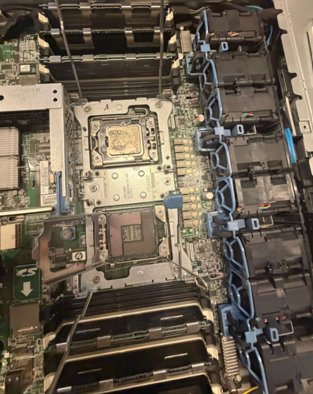

300152004

**Vérification de serveurs HP**
Pour ce travail, j'ai testé un serveur HP ProLiant, j'ai commencé par ouvrir le châssis pour inspecter l'intérieur : les deux sockets CPU, les barrettes de RAM et la rangée de ventilateurs hot-swap situés juste à côté de la carte mère. J'ai ensuite retiré à la main quelques disques durs et une barrette de RAM pour vérifier leur état physique (broches, étiquettes, capacité) avant de tout remettre en place. J'ai ensuite branché le serveur et observé l'écran de démarrage.

