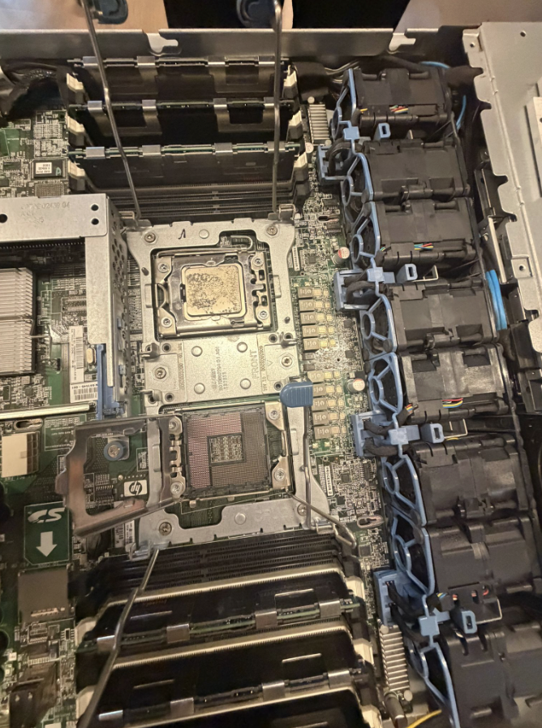

#300157250

je vais vous présenter les différentes étapes de notre projet d'installation et de configuration d'un serveur. Nous avons commencé par inspecter le matériel, puis nous avons installé le système d'exploitation, vérifié le bon fonctionnement du serveur et effectué sa configuration. Les images présentées illustrent les principales étapes de ce projet.

Le boîtier du serveur a été ouvert afin d'accéder aux composants internes. Cette étape permet d'effectuer une inspection visuelle de la carte mère, du processeur, de la mémoire RAM, des ventilateurs et des autres composants avant toute intervention.

