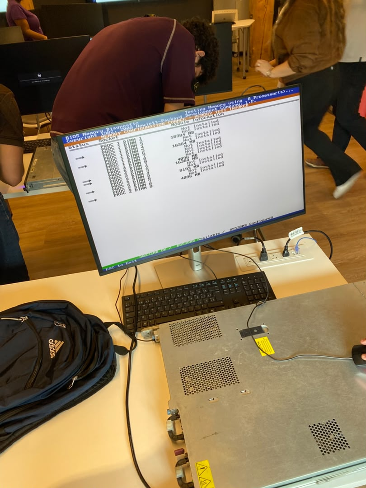

300152004

**Installation de windows server 2022**

La méthode retenue pour installer Windows Server 2022 sur le serveur est le démarrage réseau PXE (Preboot eXecution Environment).
Avant de lancer le déploiement il faut vérifier le matériel du serveur et préparer son stockage (RAID).

-Etape 1

