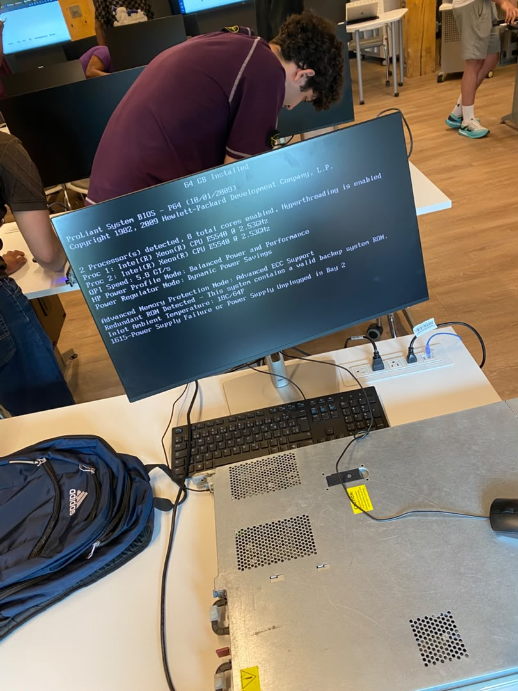
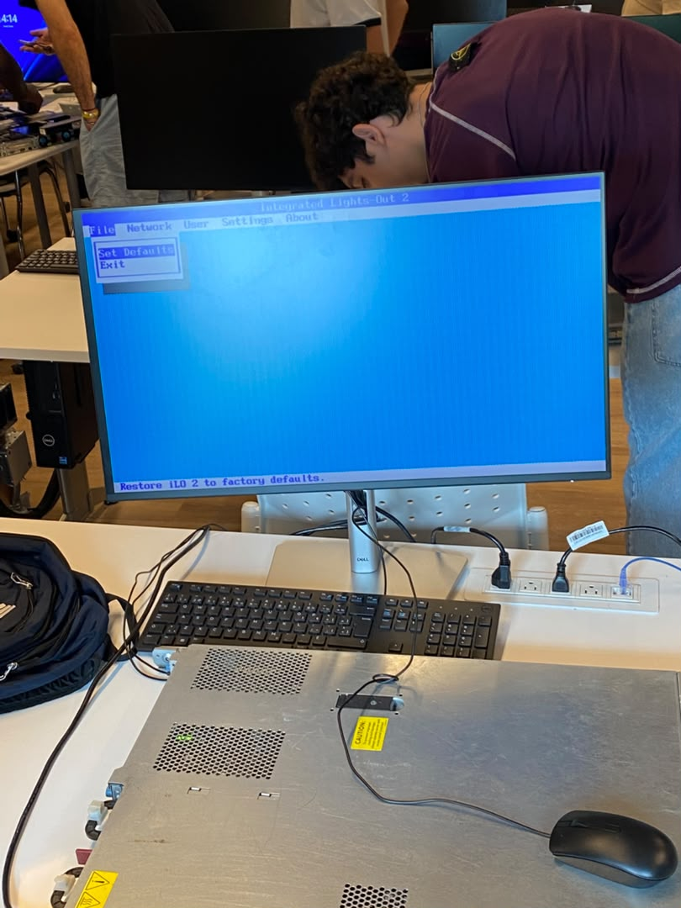
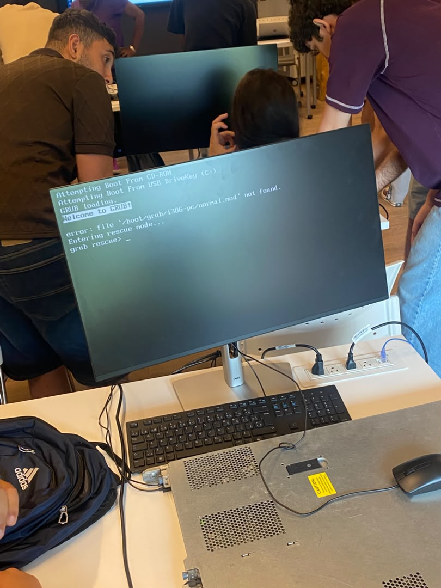
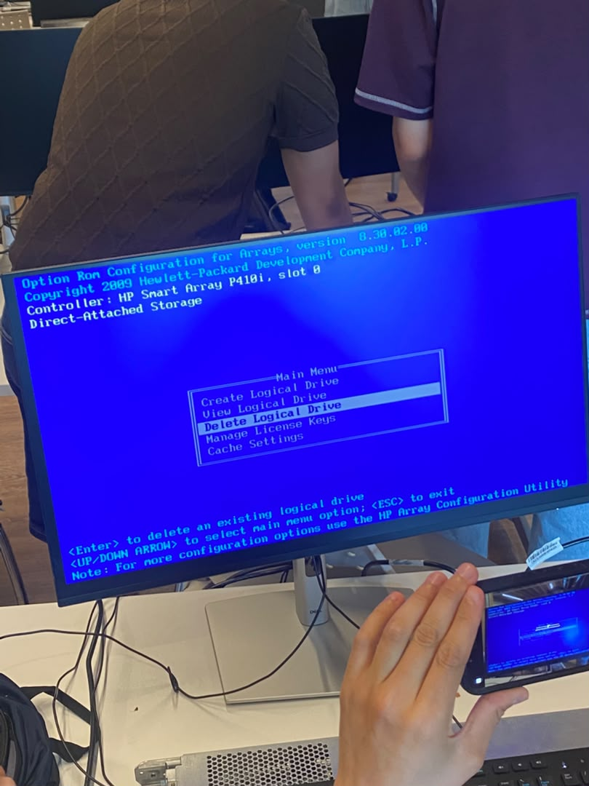
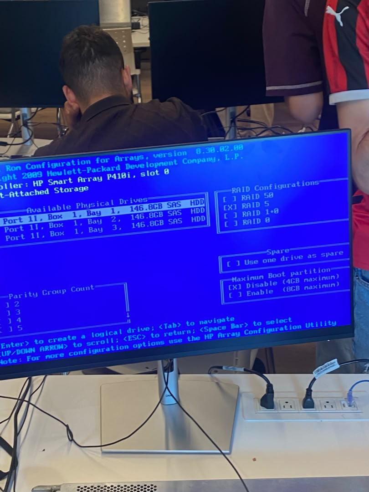
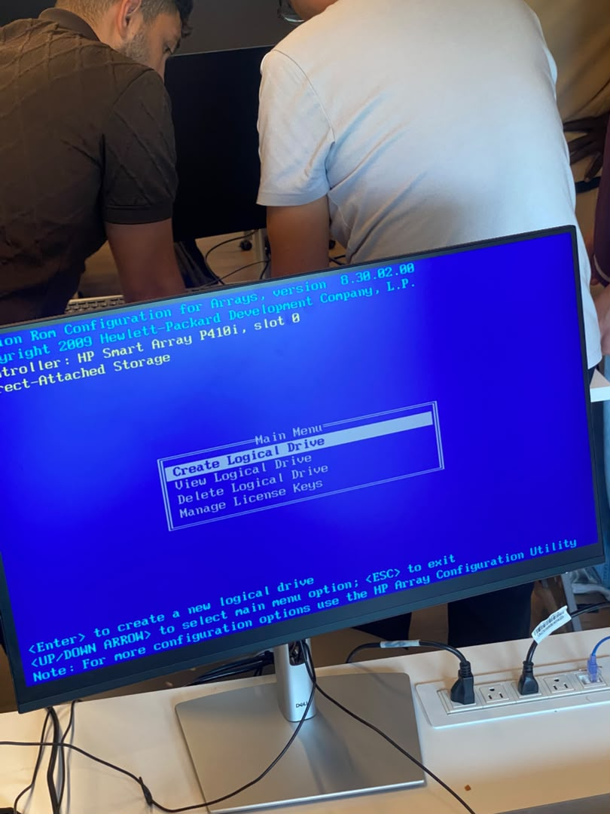
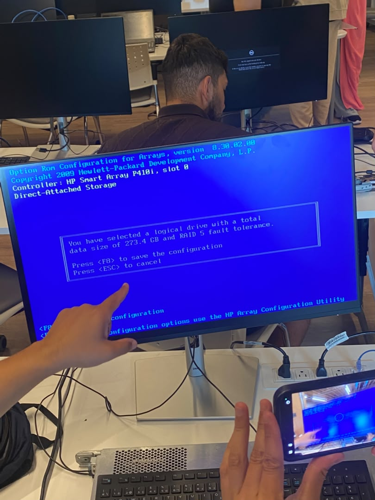
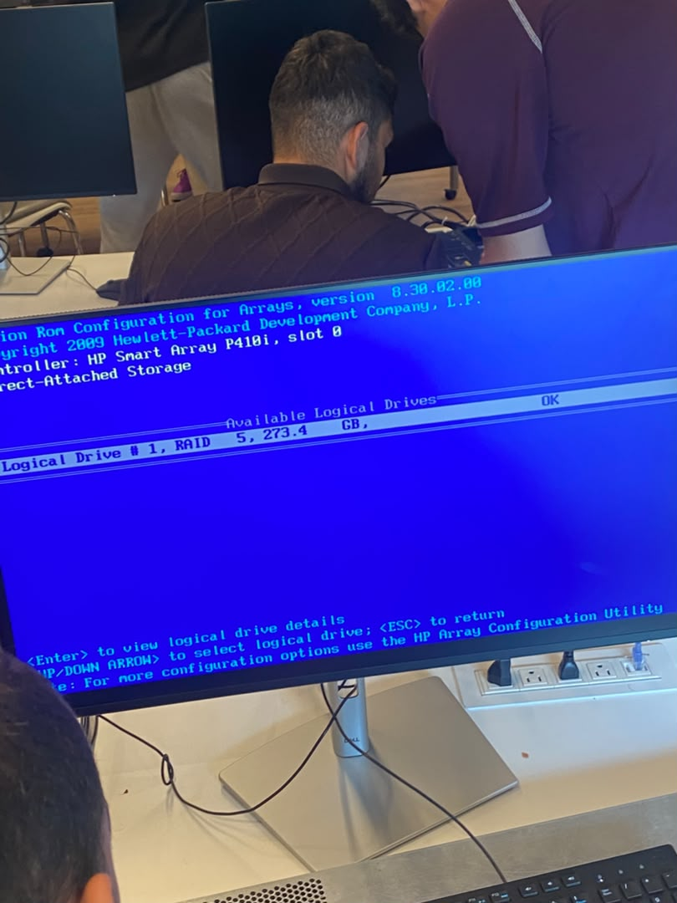
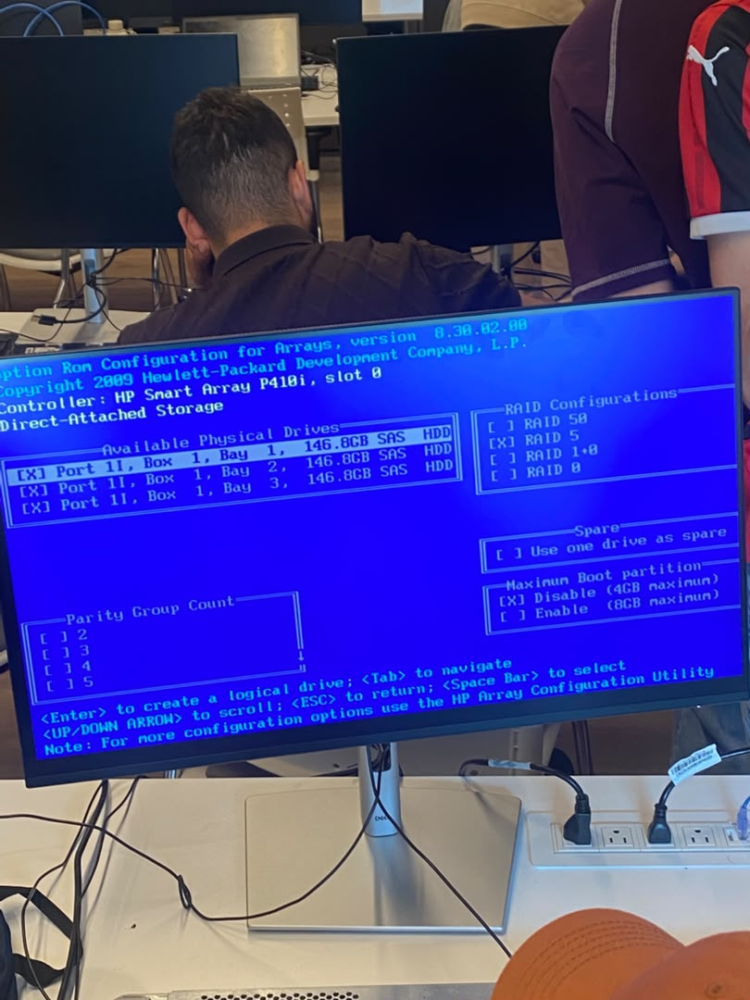

300152004

**Installation de windows server 2022**

La méthode retenue pour installer Windows Server 2022 sur le serveur est le démarrage réseau PXE (Preboot eXecution Environment).
Avant de lancer le déploiement il faut vérifier le matériel du serveur et préparer son stockage (RAID).

-Etape 1

Au démarrage du serveur un diagnostic mémoire BIOS s'exécute automatiquement. 

-Etape 2

L'écran POST affiche le résumé matériel : 64 Go de RAM installés, 2 processeurs Intel Xeon E5540 détectés, et un message d'alerte.

-Etape 3

Accès à l'utilitaire iLO 2 pour appliquer un Set Defaults.

-Etape 4

Une tentative de démarrage sur l'ancien disque échoue .

-Etape 5

Dans l'Option ROM Configuration for Arrays, l'option Delete Logical Drive est sélectionnée afin de supprimer l'ancienne unité logique et repartir sur une configuration RAID propre.

-Etape 6

Les 3 disques physiques SAS de 146,8 Go sont listés. Le niveau RAID 5 est choisi, avec le compte de parité configuré.

-Etape 7

Retour au Main Menu de l'utilitaire de configuration des tableaux, où l'option Create Logical Drive est sélectionnée pour créer la nouvelle unité logique RAID 5.

-Etape 8

Le système confirme la création d'un volume logique de 273,4 Go en RAID 5. On utilise la touche F8 pour enregistrer la configuration.

-Etape 9

L'écran Available Logical Drives confirme que le Logical Drive 1 est bien configuré en RAID 5, 273,4 Go.

-Etape 10

Les trois disques physiques sont cochés `[X]` et assignés au RAID 5, avec la partition de démarrage désactivée.

