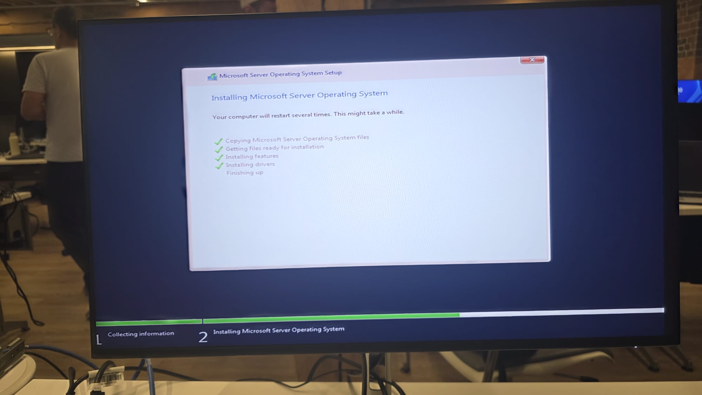
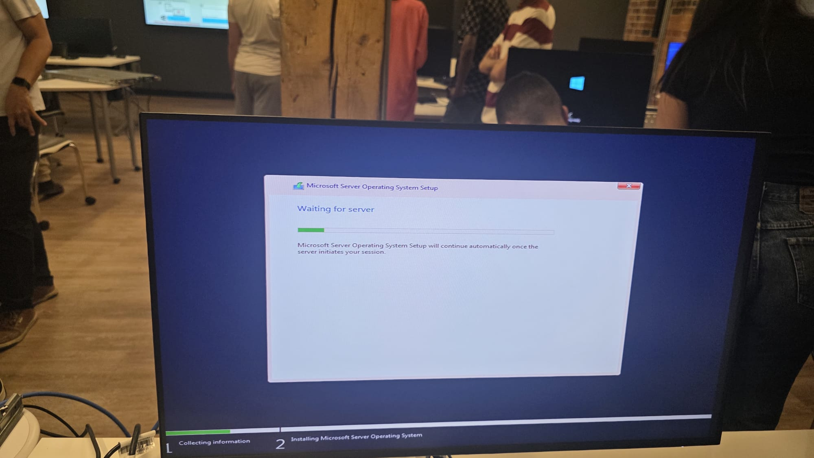
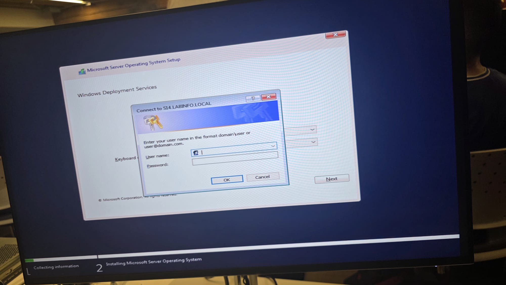
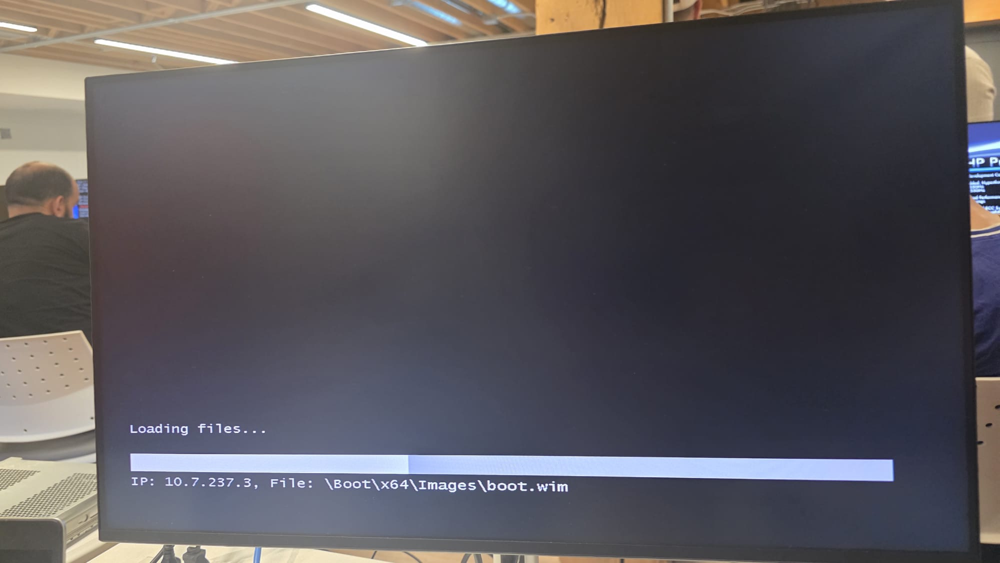
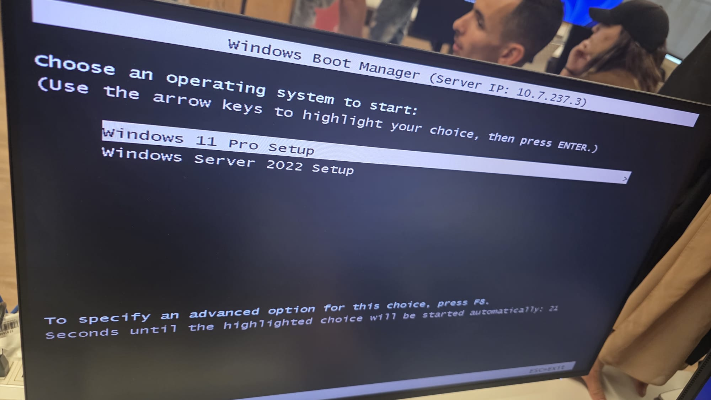

# PROJET INSTALLATION DE WINDOWS SUR UN SERVEUR 
L’installation de Windows Server commence par la préparation du serveur. Il faut vérifier que le matériel est fonctionnel, connecter les périphériques nécessaires et préparer le support d’installation, comme une clé USB bootable ou une image ISO. Ensuite, on démarre le serveur à partir de ce support en modifiant l’ordre de démarrage dans le BIOS/UEFI. Une fois l’assistant d’installation lancé, on choisit la langue, l’édition de Windows Server désirée, on accepte le contrat de licence et on sélectionne l’option d’installation personnalisée pour installer un nouveau système.

À la fin de l’installation, on configure le mot de passe du compte Administrateur et on se connecte au serveur. Les premières configurations importantes consistent à changer le nom du serveur, configurer une adresse IP statique et installer les rôles nécessaires comme Active Directory, DNS ou DHCP selon les besoins de l’organisation.

