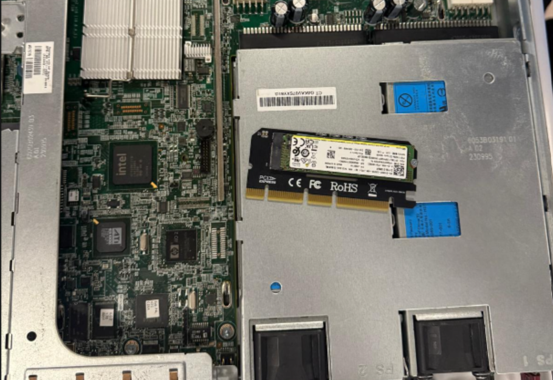
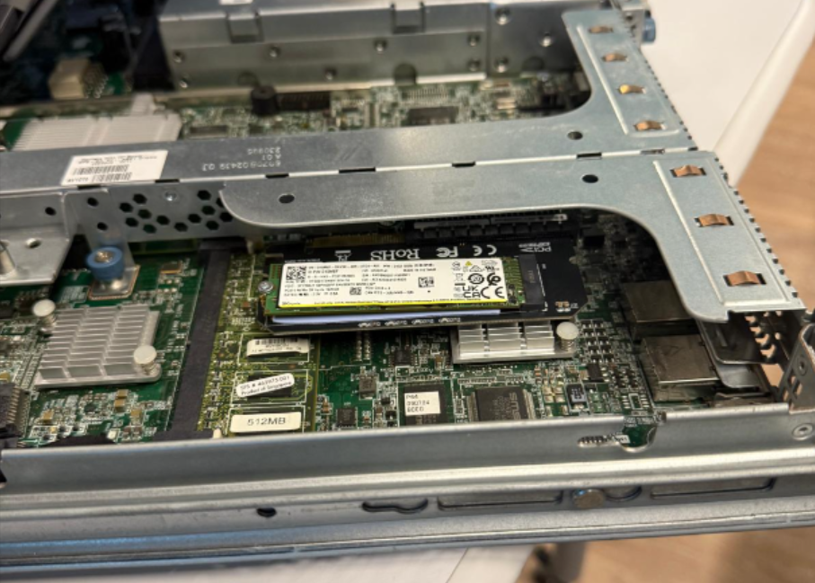
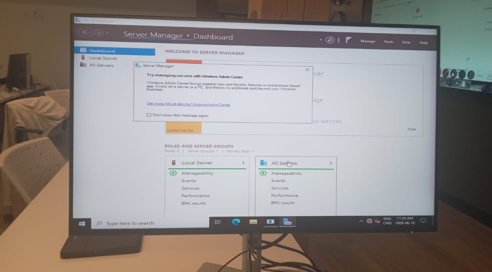
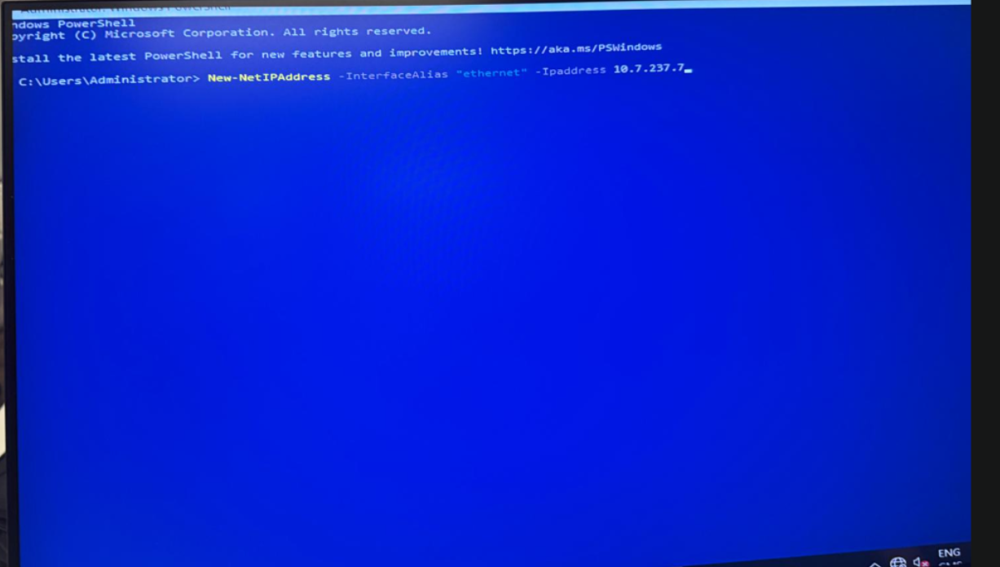
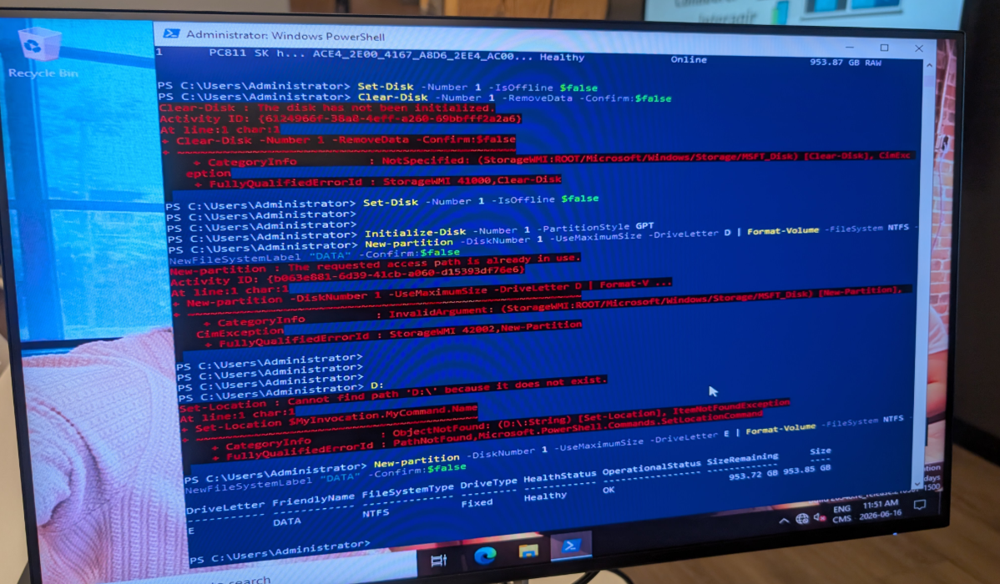
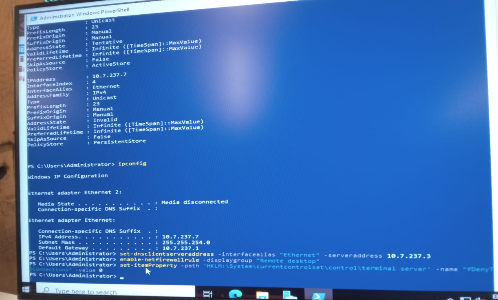
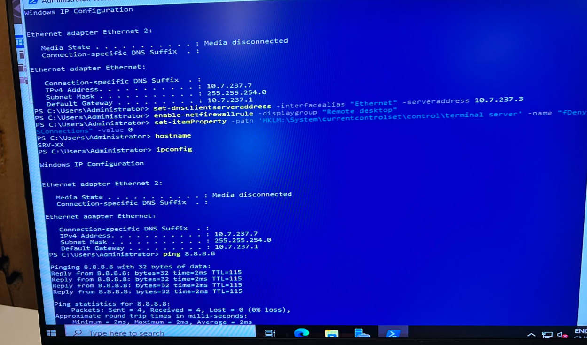

300152004

**Installation d'un disque NVMe**

Dans ce lab nous avons installer un SSD NVMe M.2 sur un adaptateur PCIe, puis nous l'avons initialiser et formater directement dans Windows Server via PowerShell. Cette approche permet d'ajouter rapidement un volume de stockage en évitant de remplacer les disques SAS/SATA existants.

-étape 1: 

On insère le SSD M.2 NVMe dans la carte adaptatrice PCIe.

-étape 2:

La carte adaptatrice avec le NVMe est insérée dans un slot PCIe libre du châssis du serveur.

-étape 3:

Une fois Windows Server 2022 démarré, on ouvre le Server Manager pour confirmer que le système est opérationnel et accessible avant de procéder à la configuration du disque.

-étape 4:

Avant de configurer le disque, on attribue une adresse IP statique au serveur via PowerShell.

-étape 5:

Le nouveau disque NVMe apparaît d'abord comme RAW dans le système. La première tentative de Clear-Dis` a échoué car le disque n'était pas encore initialisé, il a donc fallu d'abord le mettre en ligne puis l'initialiser en style GPT avant de créer la partition.

-étape 6:

Pour finaliser l'intégration du serveur au mini data center, on configure le DNS et on active l'accès à distance.

-étape 7:

On confirme le nom d'hôte du serveur (`hostname` SRV-XX), l'adresse IP attribuée (10.7.237.7), puis on teste la connectivité Internet avec via ping 8.8.8.8
Le test retourne 4 paquets envoyés / 4 reçus / 0% de perte, confirmant que le serveur est bien connecté au réseau et prêt à être utilisé comme nœud du mini data center.
