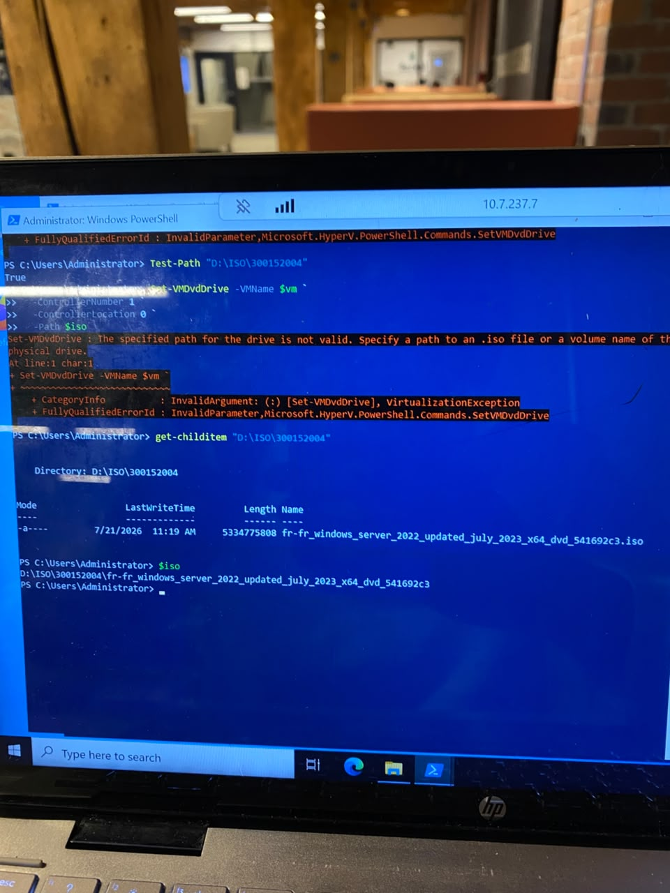
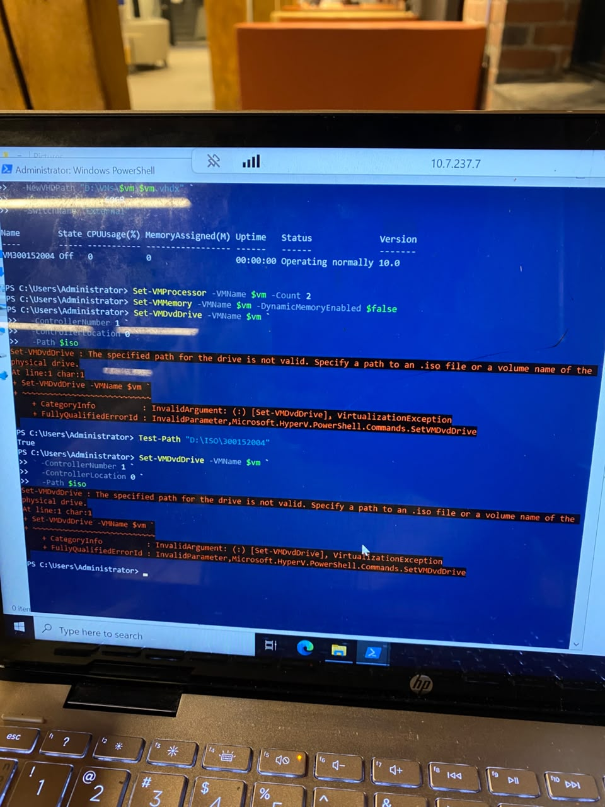
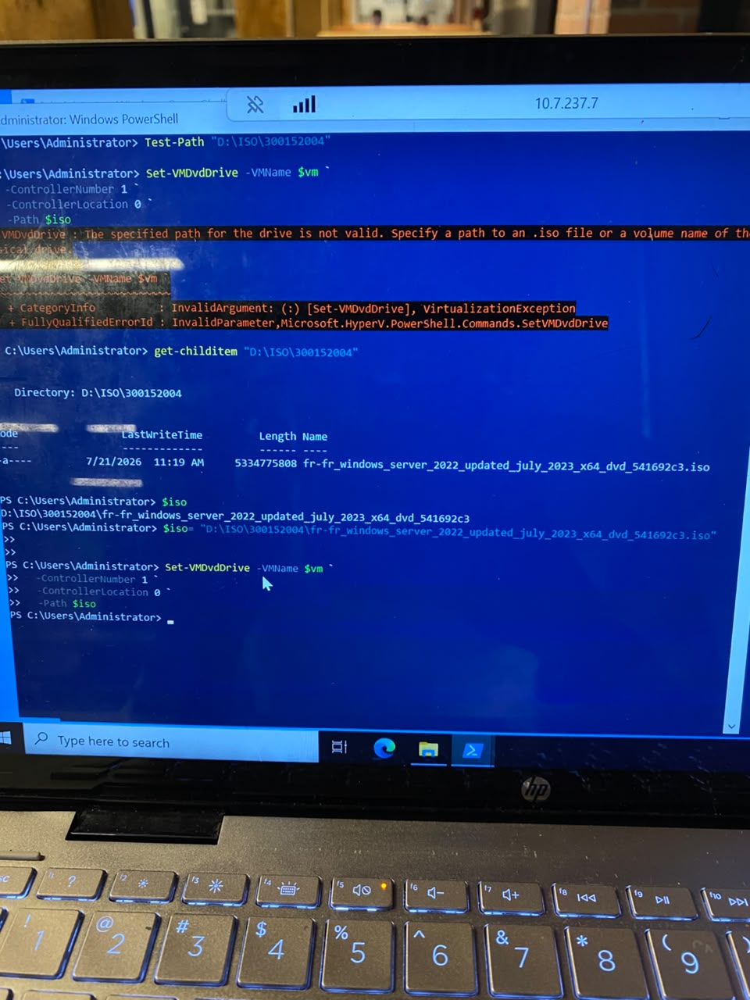
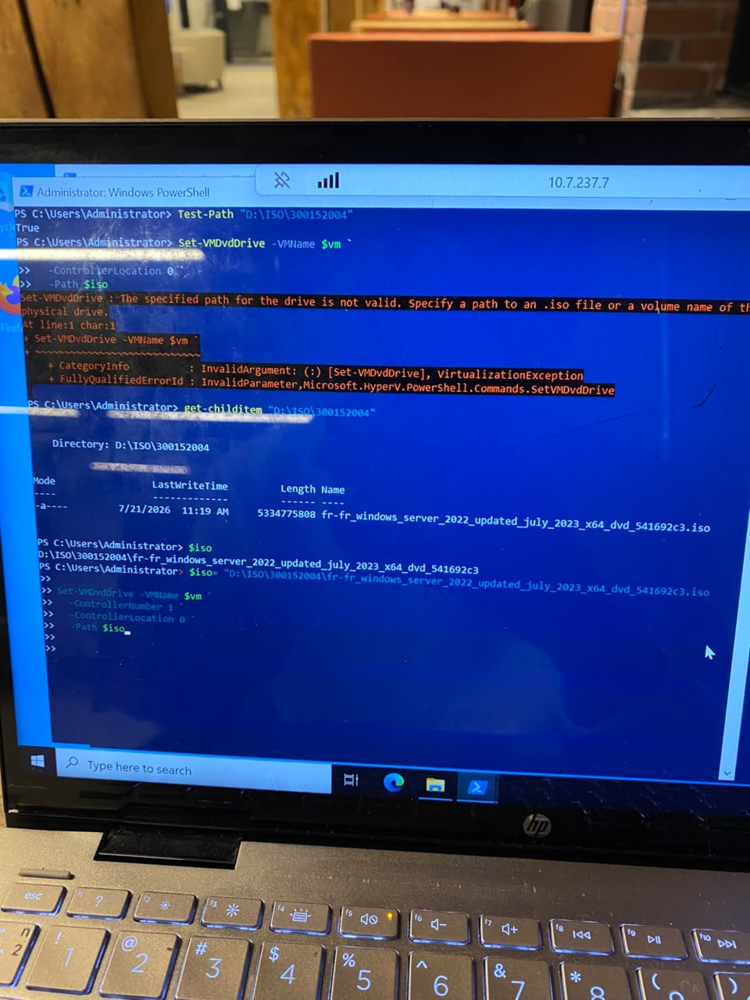
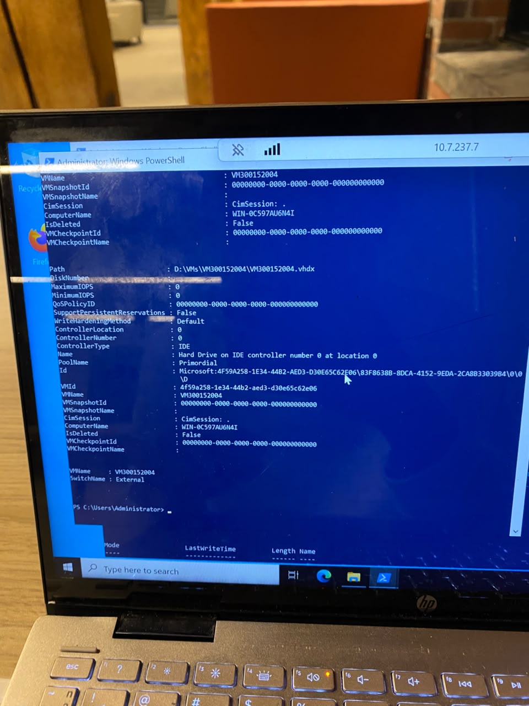
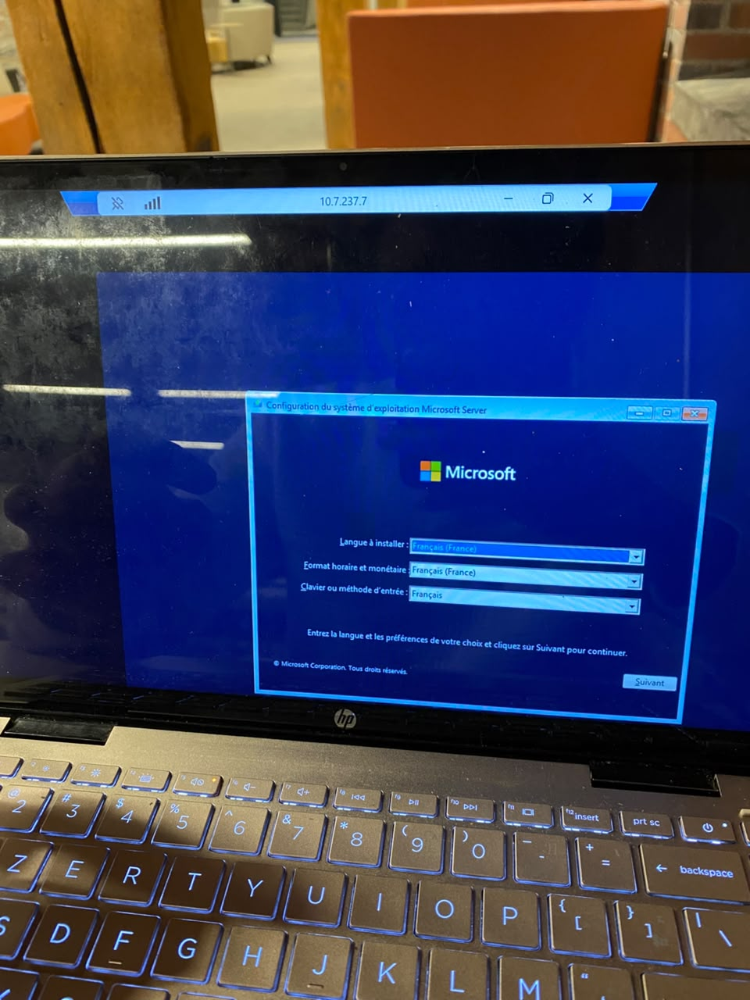
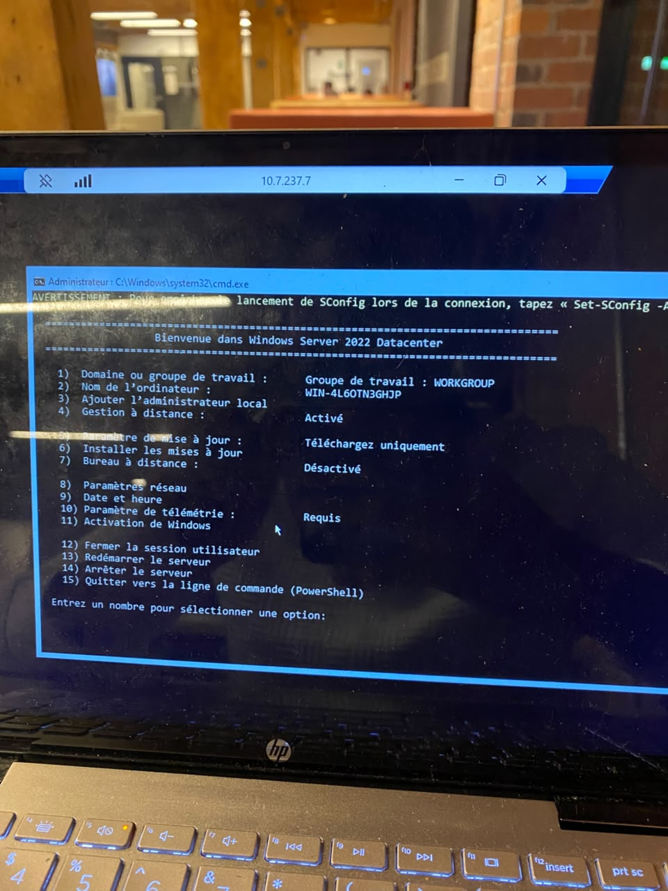
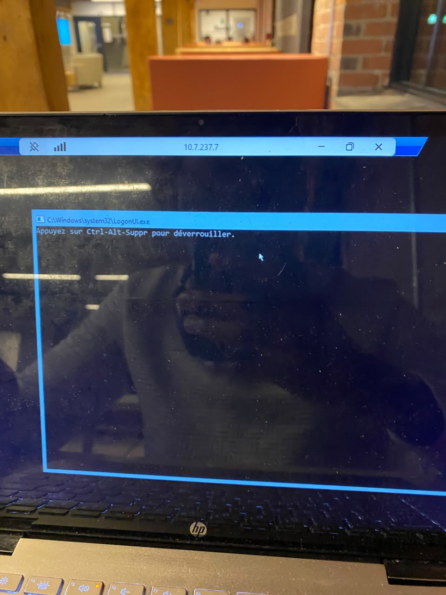

300152004

**Création d'une VM Windows Server 2022 sous Hyper-V**

Dans ce lab j'ai crée une machine virtuelle Windows Server 2022 sous Hyper-V; j'ai d'abord téléchargé l'ISO officiel depuis Azure Education, configuré la VM en génération 1 avec des ressources précises (2 CPU, 4 GB de RAM fixe, disque de 60 GB, réseau External), puis j'ai monté l'ISO pour démarrer l'installation du système d'exploitation.

-étape 1: 

Je vérifie d'abord que le dossier contenant mon ISO existe bien avec `Test-Path "D:\ISO\300152004"`, qui retourne `True`. J'essaie ensuite de monter l'ISO sur le lecteur DVD virtuel de la VM avec `Set-VMDvdDrive`.

-étape 2:

Ici, je configure les ressources de la VM : `Set-VMProcessor -VMName $vm -Count 2` pour attribuer 2 CPU, et `Set-VMMemory -VMName $vm -DynamicMemoryEnabled $false` pour fixer la mémoire à une valeur statique.

-étape 3:

Je corrige le problème en réassignant correctement la variable : `$iso = "D:\ISO\300152004\fr-fr_windows_server_2022_updated_july_2023_x64_dvd_541692c3.iso"`, cette fois avec le nom complet du fichier et l'extension `.iso`.

-étape 4:

On voit la commande `Set-VMDvdDrive` complète en cours de saisie avec la nouvelle valeur de `$iso` pointant directement vers le fichier `.iso`.

-étape 5:

Avec `Get-VMHardDiskDrive`, je vérifie que le disque dur virtuel de la VM est bien configuré : chemin `D:\VMs\VM300152004\VM300152004.vhdx`, contrôleur de type `IDE`, `ControllerNumber 0`, `ControllerLocation 0`. 

-étape 6:

Après avoir démarré la VM et bootée sur l'ISO monté, l'assistant d'installation de Windows Server 2022 apparaît. Je confirme les paramètres de langue, de format horaire/monétaire et de clavier (Français) puis je clique sur Suivant pour lancer l'installation.

-étape 7:

Une fois l'installation terminée et le premier démarrage effectué, l'outil de configuration en ligne de commande SConfig s'affiche .

-étape 8:

L'écran affiche "Appuyez sur Ctrl-Alt-Suppr pour déverrouiller", confirmant que le système d'exploitation Windows Server est bien installé et opérationnel, prêt pour la connexion.

