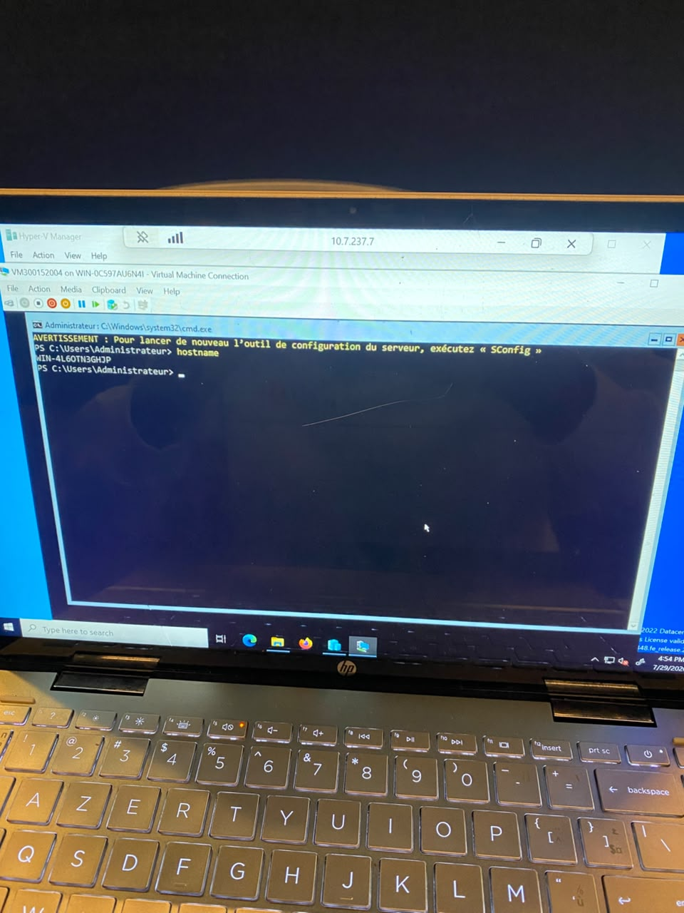
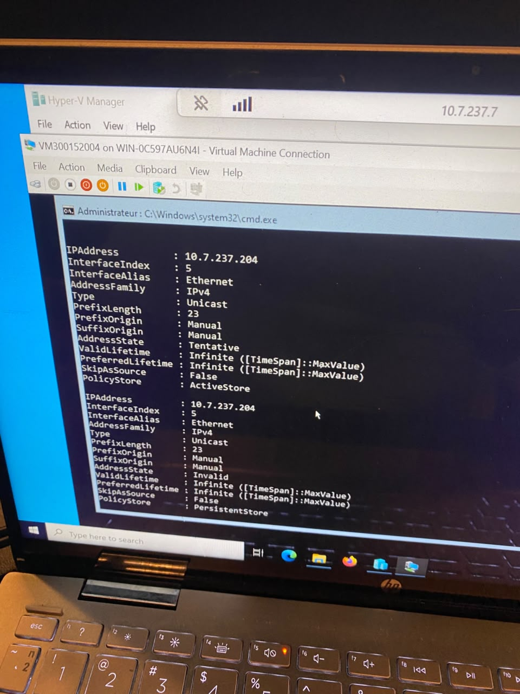
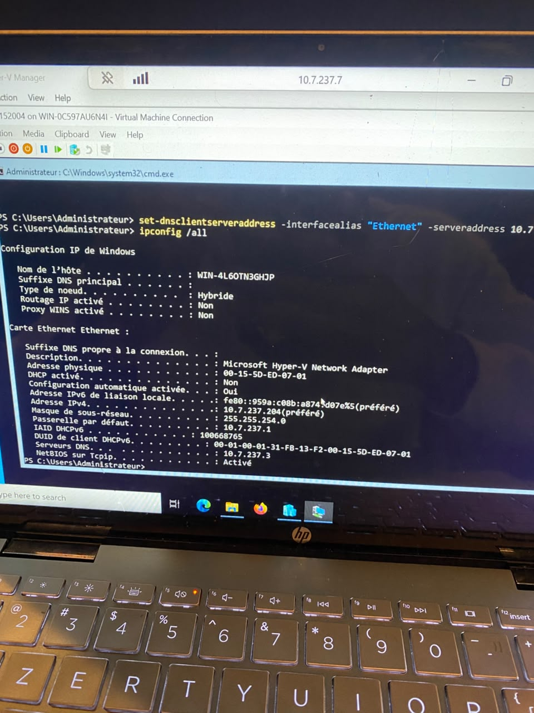
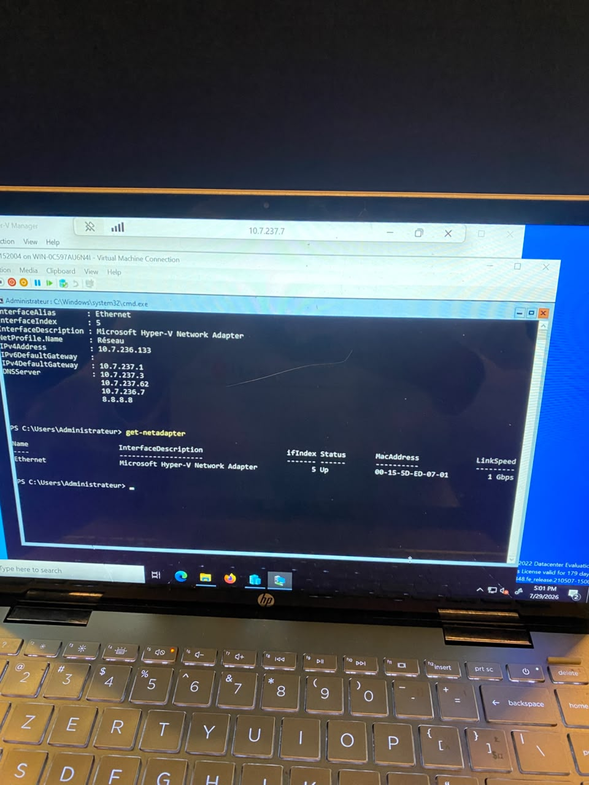
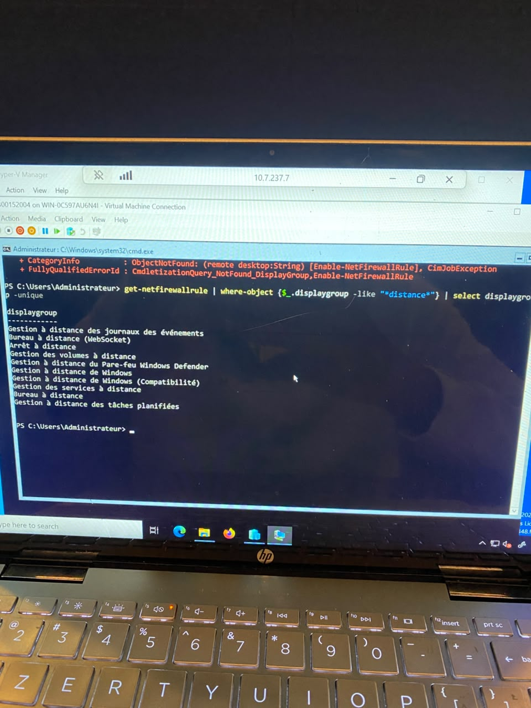
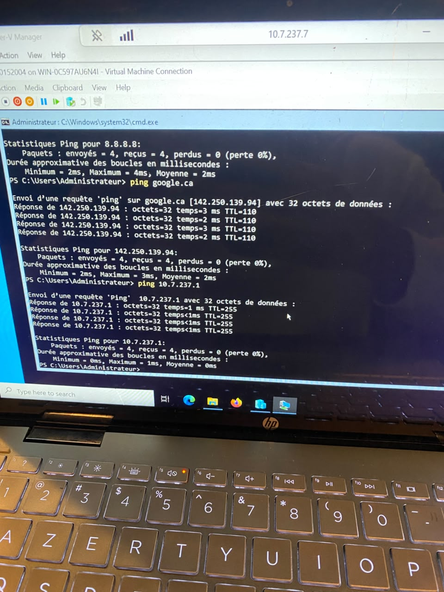
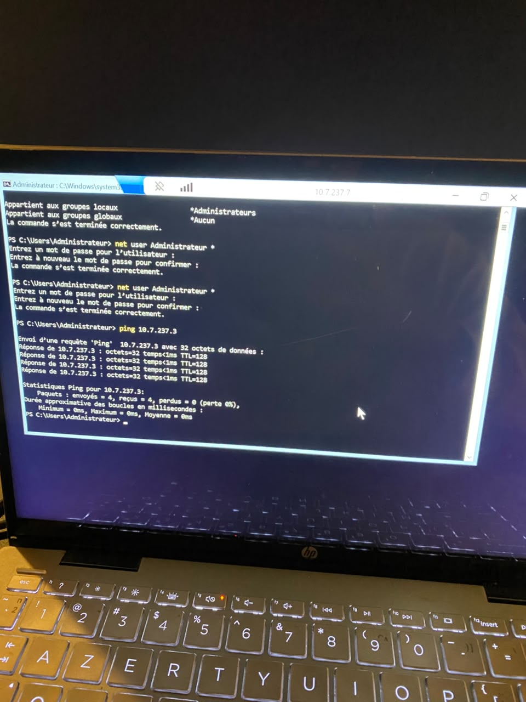
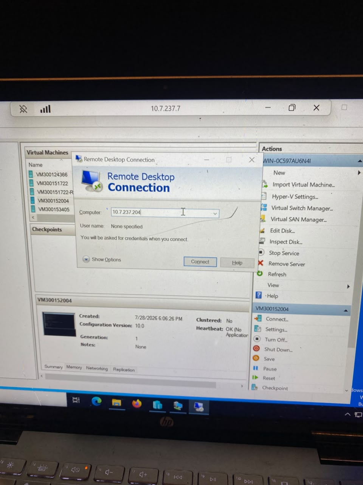

300152004

**Configuration réseau et accès à distance (RDP)**

Dans ce lab j'ai finalisé la configuration réseau de la VM Windows Server créée précédemment je lui ai attribué une adresse IP statique, configuré son serveur DNS et sa passerelle par défaut, puis vérifié que la connectivité fonctionne.

-étape 1: 

Connecté à la VM via Hyper-V Manager, j'exécute la commande `hostname` dans PowerShell pour confirmer le nom de la machine : `WIN-4L6OTN3GHJP`.

-étape 2:

J'attribue une adresse IP statique à la carte réseau de la VM (via `New-NetIPAddress` / `Set-NetIPAddress`). La sortie confirme l'adresse `10.7.237.204`.

-étape 3:

Je configure le serveur DNS avec `Set-DnsClientServerAddress -InterfaceAlias "Ethernet" -ServerAddress 10.7.`. La commande `ipconfig /all` confirme ensuite l'ensemble de la configuration réseau.

-étape 4:

Avec `Get-NetIPConfiguration` et `get-netadapter`, je valide que l'interface `Ethernet` (adaptateur réseau virtuel Hyper-V) est bien à l'état Up, avec une vitesse de liaison de 1 Gbps et une adresse MAC assignée (`00-15-5D-ED-07-01`).

-étape 5:

Avec `Get-NetFirewallRule`, je liste les groupes d'affichage contenant *"distance"* afin d'identifier la bonne règle (*"Bureau à distance"*), puis j'active la règle appropriée avec `Enable-NetFirewallRule` pour permettre les connexions entrantes RDP.

-étape 6:

Je vérifie la connectivité Internet et locale avec plusieurs commandes `ping` :
- `ping 8.8.8.8`
- `ping google.ca`
- `ping 10.7.237.1`

-étape 7:

Je réinitialise le mot de passe du compte `Administrateur` avec `net user Administrateur ` (nécessaire pour pouvoir se connecter en RDP par la suite). Je teste ensuite `ping 10.7.237.3` (le serveur DNS) qui répond correctement avec, confirmant que toute la chaîne réseau (IP, passerelle, DNS) est fonctionnelle.

-étape 8:

Depuis l'hôte, j'ouvre Connexion Bureau à distance et je saisis l'adresse IP de la VM (`10.7.237.204`).

