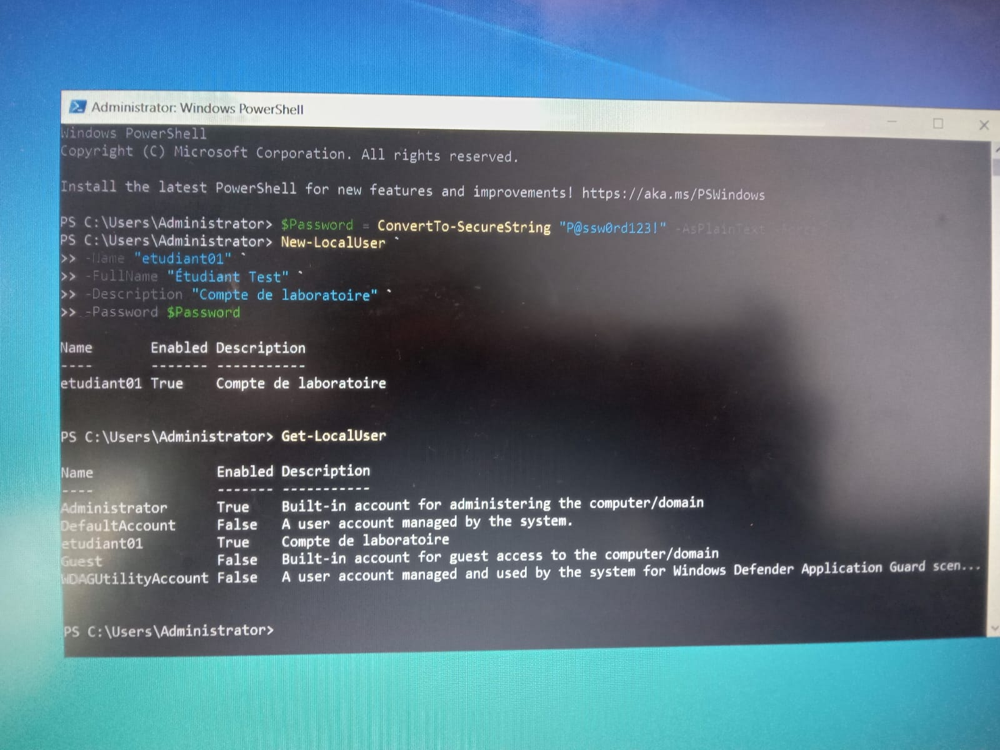

\## Informations du laboratoire


\*\*Cours :\*\* Administration des systèmes 

\*\*Sujet :\*\* Gestion des utilisateurs, groupes et permissions avec PowerShell  

\*\*Étudiant :\*\* 300124366  


\---


\# Objectif


L'objectif de ce laboratoire est d'apprendre à gérer les utilisateurs locaux, les groupes et les permissions de fichiers à l'aide de PowerShell.


Les opérations suivantes ont été réalisées pendant ce laboratoire:


\- Création et gestion de comptes utilisateurs locaux.

\- Création et administration de groupes.

\- Ajout d'utilisateurs dans des groupes.

\- Attribution de permissions sur un dossier.

\- Activation et désactivation de comptes utilisateurs.

\- Suppression des ressources créées.

\- Application des bonnes pratiques de sécurité avec PowerShell.


\---


\# Prérequis


Avant de commencer, les éléments suivants sont nécessaires :


\- Windows 10/11 ou Windows Server.

\- PowerShell exécuté en tant qu'administrateur.

\- Un compte avec des privilèges administratifs.


\---


La première étape consiste à créer un mot de passe sécurisé qui sera utilisé pour les comptes utilisateurs.


Commande utilisée :


```powershell

$Password = ConvertTo-SecureString "P@ssw0rd123!" -AsPlainText -Force




