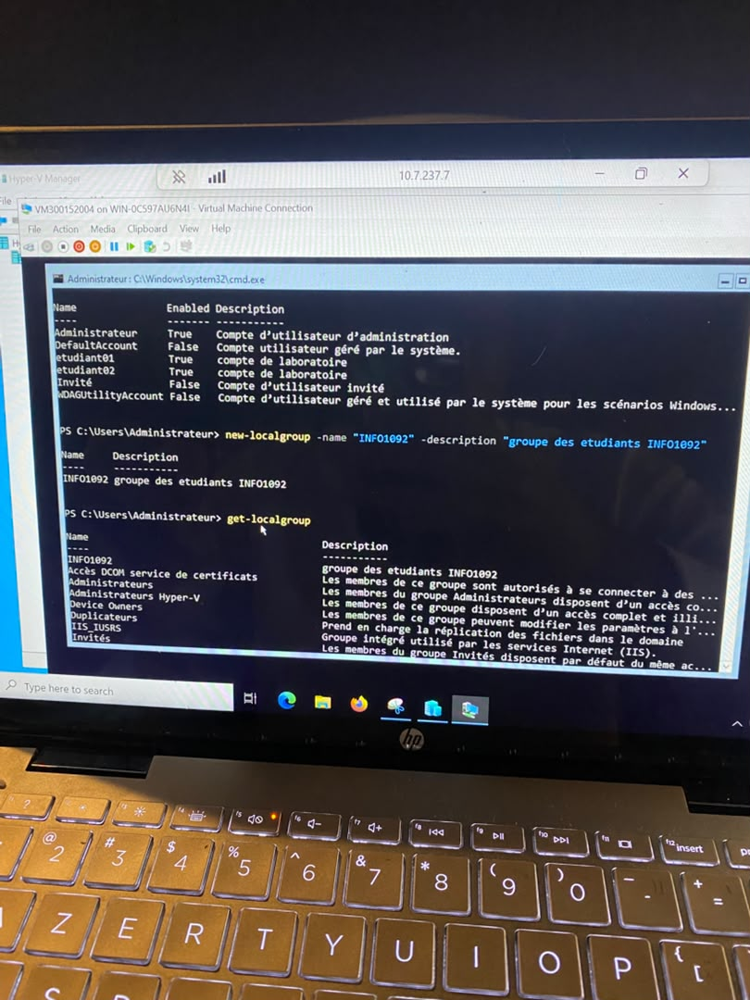
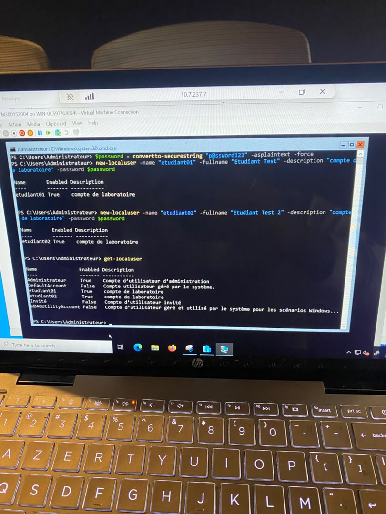
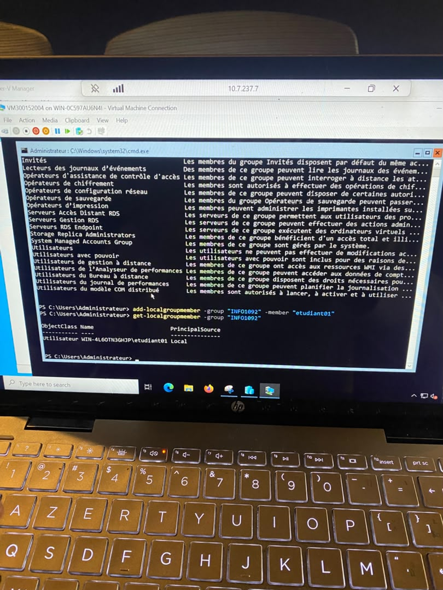
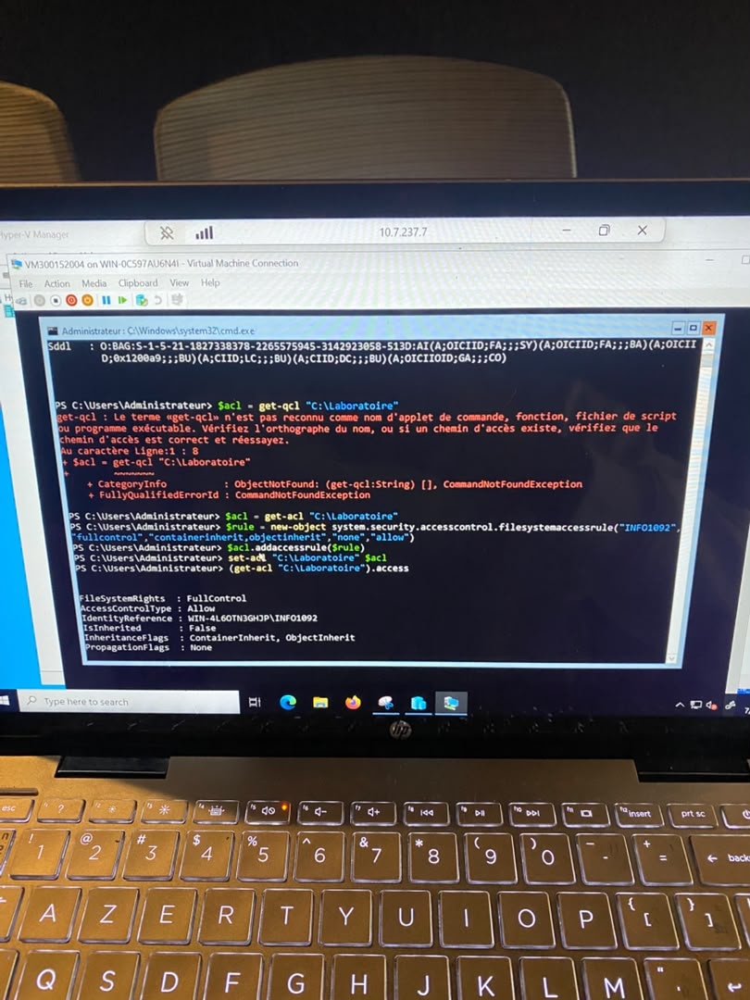
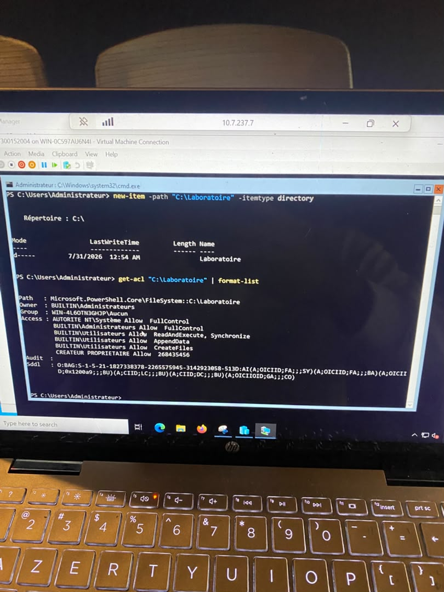
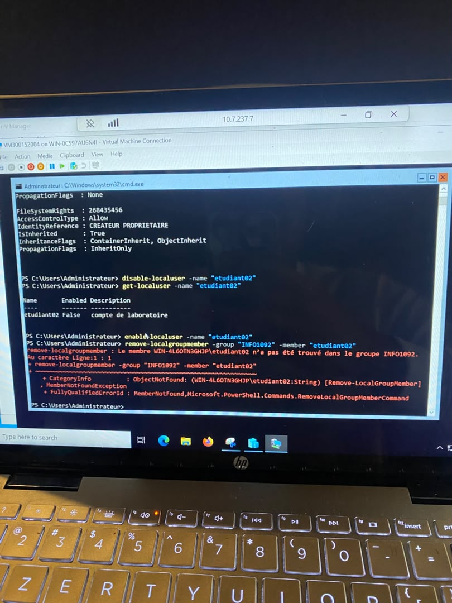
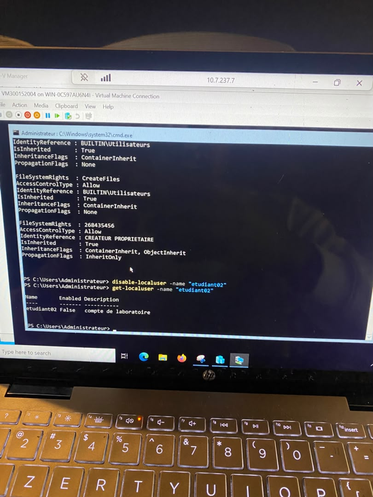
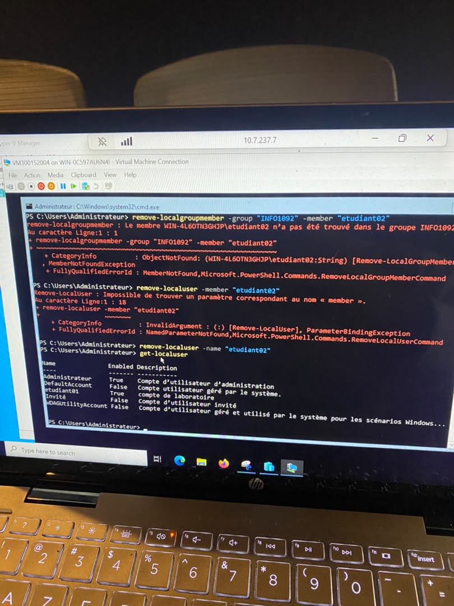
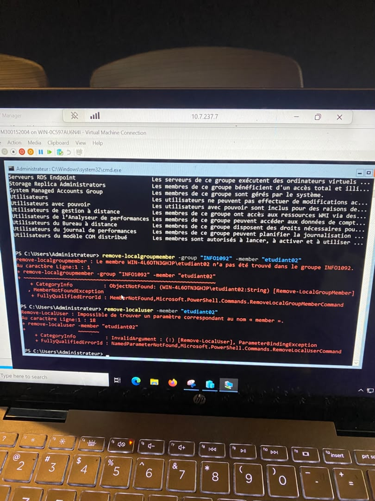

300152004

**Gestion des utilisateurs (INF1092)**

Dans ce lab j'ai géré les utilisateurs, groupes et permissions localement sous Windows avec PowerShell; j'ai crée des comptes utilisateurs (etudiant01, etudiant02), les ai regroupé dans un groupe (INFO1092), puis utilisé ce groupe pour attribuer des permissions à un dossier partagé.

-étape 1: 

Je crée d'abord un mot de passe sécurisé avec `$password = ConvertTo-SecureString "p@ssword123" -AsPlainText -Force`, puis je crée les deux comptes de laboratoire avec `New-LocalUser` : `etudiant01` et `etudiant02`, chacun avec la description "compte de laboratoire" et le mot de passe sécurisé. La commande `Get-LocalUser` finale confirme que les deux comptes sont bien créés et activés. 

-étape 2:

Après avoir vérifié la liste des utilisateurs locaux existants (incluant `etudiant01` et `etudiant02`), je crée le groupe avec `New-LocalGroup -Name "INFO1092", La commande `Get-LocalGroup` confirme ensuite que le groupe INFO1092 apparaît bien dans la liste des groupes locaux du système.

-étape 3:

J'ajoute `etudiant01` au groupe `INFO1092` avec `Add-LocalGroupMember -Group "INFO1092" -Member "etudiant01"`. La commande `Get-LocalGroupMember -Group "INFO1092"` confirme l'appartenance .

-étape 4:

Je crée le dossier avec `New-Item -Path "C:\Laboratoire" -ItemType Directory`. La commande `Get-Acl "C:\Laboratoire" | Format-List` affiche ensuite les permissions par défaut.

-étape 5:

je crée la règle `$rule = New-Object System.Security.AccessControl.FileSystemAccessRule("INFO1092","FullControl","ContainerInherit,ObjectInherit","None","Allow")`, je l'ajoute avec `$acl.AddAccessRule($rule)` puis j'applique le tout avec `Set-Acl "C:\Laboratoire" $acl`. La vérification finale `(Get-Acl "C:\Laboratoire").Access` confirme le résultat.

-étape 6:

Je désactive le compte `etudiant02` avec `Disable-LocalUser -Name "etudiant02"`. La vérification avec `Get-LocalUser -Name "etudiant02"` confirme que le compte est maintenant à l'état `Enabled: False`.

-étape 7:

Je tente de retirer `etudiant02` du groupe avec `Remove-LocalGroupMember -Group "INFO1092" -Member "etudiant02"`, mais j'obtiens une erreur "Le membre ... n'a pas été trouvé dans le groupe INFO1092" logique, puisque seul `etudiant01.

-étape 8:

Je confirme la même erreur de retrait de groupe, puis j'essaie de supprimer l'utilisateur avec `Remove-LocalUser -member "etudiant02".

-étape 9:

Je corrige avec la bonne syntaxe : `Remove-LocalUser -Name "etudiant02"`, qui s'exécute sans erreur. La commande `Get-LocalUser` finale confirme la suppression : seul `etudiant01` reste parmi les comptes personnalisés.

Réponses aux questions d'analyse : 
1. Un utilisateur est un compte individuel qui identifie une personne (ou un service) et permet de s'authentifier sur le système tandis que Un groupe est un ensemble d'utilisateurs regroupés sous un même nom.
2. Parce que c'est beaucoup plus simple et plus sûr à gérer à grande échelle : au lieu de configurer les permissions individuellement pour chaque utilisateur, on les attribue une seule fois au groupe.
3. C'est le principe selon lequel chaque utilisateur ne devrait avoir accès qu'aux ressources et permissions strictement nécessaires pour accomplir ses tâches, rien de plus.
4. `Get-LocalUser`
5. `Get-LocalGroupMember -Group "NomDuGroupe"`
