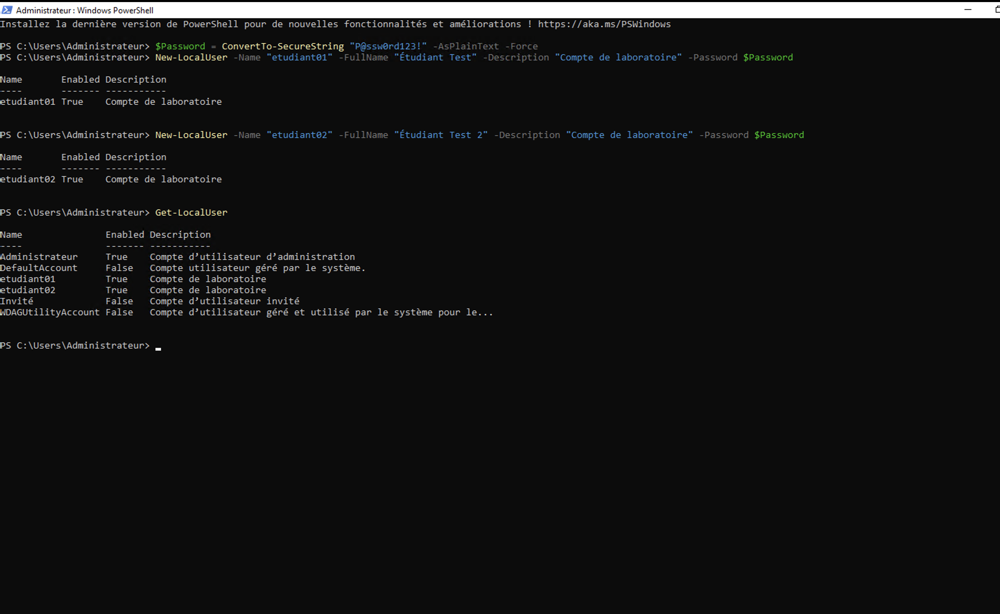
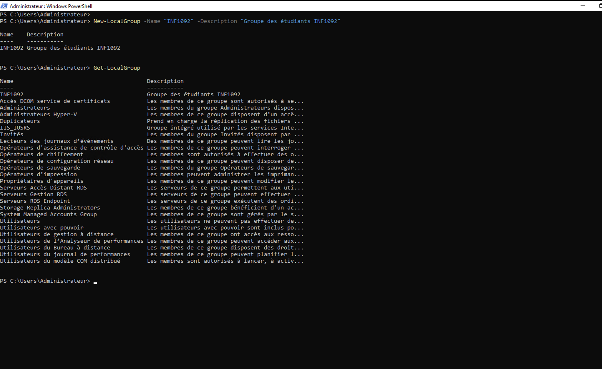
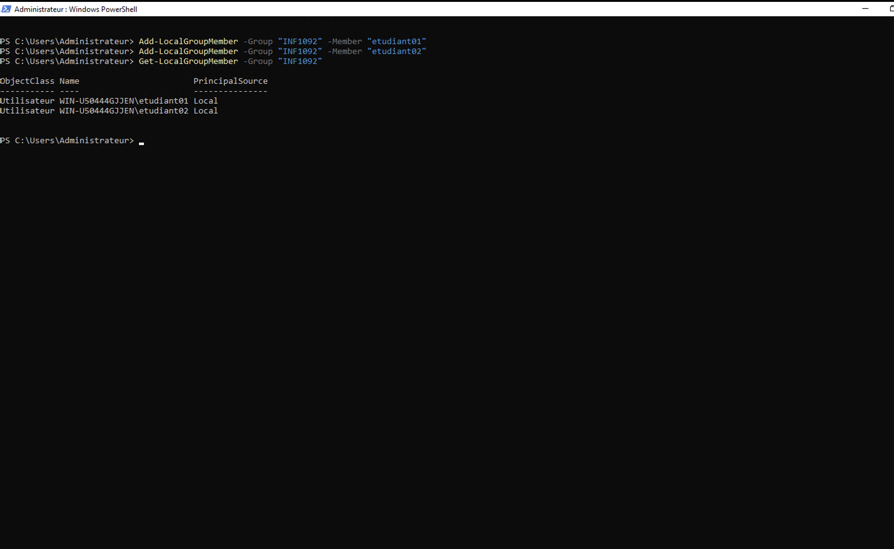
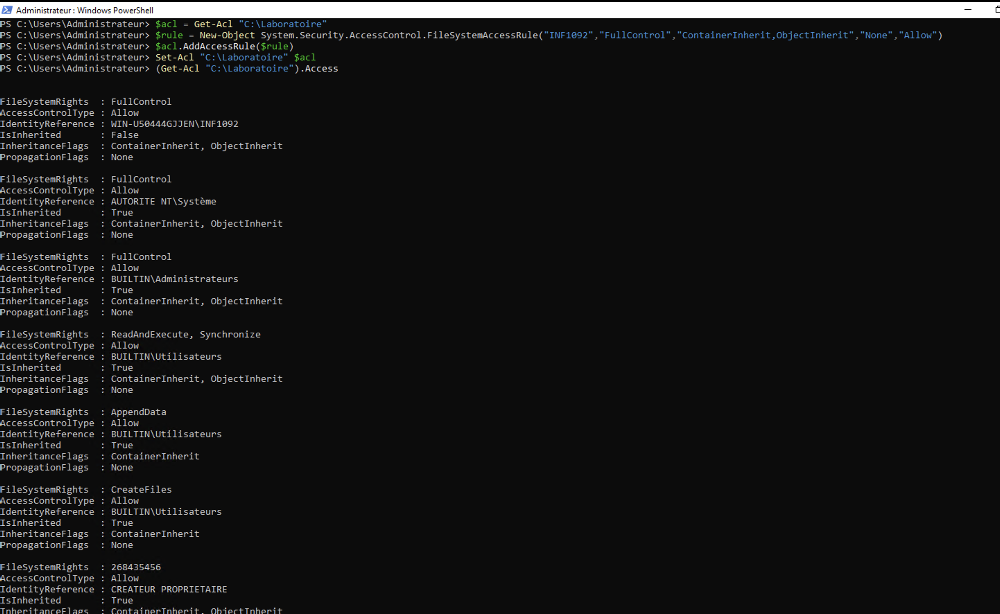
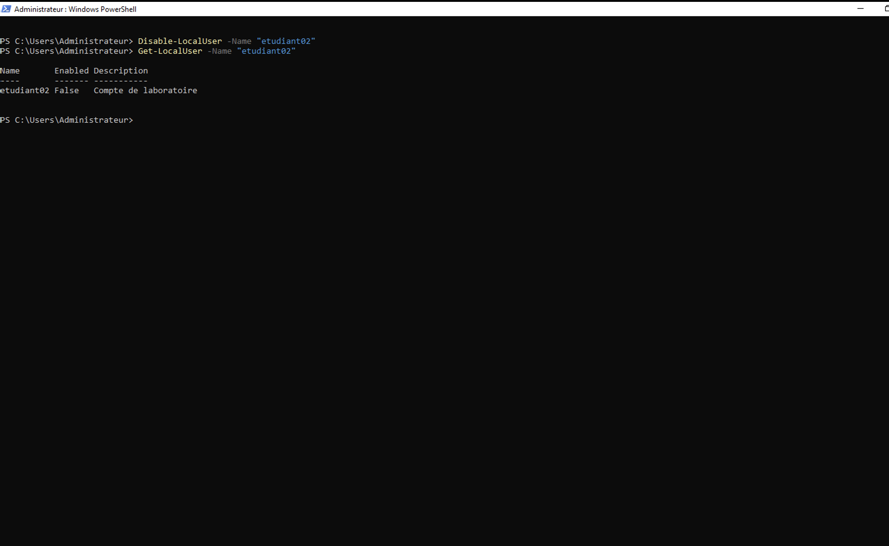
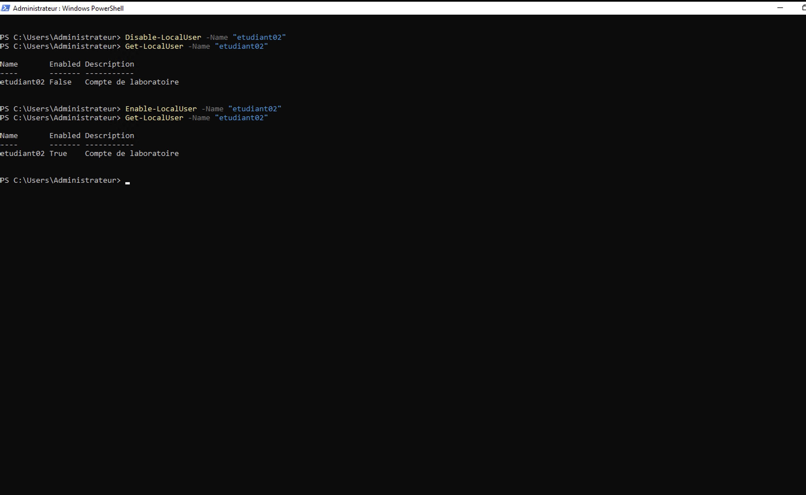

# Laboratoire PowerShell : Gestion des utilisateurs, groupes et permissions

## Objectif du laboratoire

Dans ce laboratoire, j’ai utilisé PowerShell pour gérer des utilisateurs locaux, créer un groupe, attribuer des permissions à un dossier et vérifier les accès. L’objectif était de comprendre comment un administrateur peut organiser les comptes et les permissions de façon plus claire, plus rapide et plus sécurisée.

---

## Captures du laboratoire

### 1. Création des utilisateurs locaux

J’ai commencé par créer les comptes `etudiant01` et `etudiant02` avec un mot de passe sécurisé converti avec `ConvertTo-SecureString`.



### 2. Création du groupe INF1092

J’ai créé le groupe local `INF1092`. Ce groupe sert à regrouper les utilisateurs du laboratoire afin de gérer leurs permissions plus facilement.



### 3. Ajout des utilisateurs dans le groupe

Les comptes `etudiant01` et `etudiant02` ont été ajoutés au groupe `INF1092`. La commande `Get-LocalGroupMember` permet de vérifier que les utilisateurs sont bien membres du groupe.



### 4. Attribution des permissions sur le dossier C:\Laboratoire

J’ai créé le dossier `C:\Laboratoire`, puis j’ai donné au groupe `INF1092` l’accès complet avec la permission `FullControl`. Cette méthode est plus propre que de donner les permissions directement à chaque utilisateur, car les droits sont centralisés au niveau du groupe.



### 5. Désactivation du compte etudiant02

J’ai désactivé le compte `etudiant02` avec la commande `Disable-LocalUser`. Cela permet de bloquer temporairement l’accès d’un utilisateur sans supprimer son compte.



### 6. Réactivation du compte etudiant02

J’ai ensuite réactivé le compte avec `Enable-LocalUser`. Cette étape montre qu’un administrateur peut rapidement rétablir l’accès d’un utilisateur au besoin.



---

## Questions d’analyse

### 1. Quelle est la différence entre un utilisateur et un groupe ?

Un utilisateur est un compte individuel qui représente une personne ou un accès précis sur le système. Il permet de se connecter, d’ouvrir une session et d’utiliser les ressources autorisées.

Un groupe sert à rassembler plusieurs utilisateurs. Au lieu de gérer les permissions compte par compte, on donne les droits au groupe, puis les utilisateurs membres du groupe héritent de ces permissions.

### 2. Pourquoi utilise-t-on les groupes pour attribuer des permissions ?

On utilise les groupes parce que c’est plus simple et plus sécuritaire en administration système. Si les permissions sont données directement à chaque utilisateur, la gestion devient rapidement compliquée.

Avec un groupe, les permissions sont centralisées. Par exemple, si le groupe `INF1092` possède l’accès complet au dossier `C:\Laboratoire`, tous les membres du groupe ont les mêmes droits. Si un nouvel utilisateur doit avoir accès, il suffit de l’ajouter au groupe. S’il ne doit plus avoir accès, on le retire simplement du groupe.

### 3. Que signifie le principe du moindre privilège ?

Le principe du moindre privilège signifie qu’un utilisateur doit recevoir seulement les permissions nécessaires pour faire son travail, sans accès supplémentaire inutile.

Par exemple, si un utilisateur a seulement besoin de lire un fichier, il ne devrait pas recevoir un accès complet. Ce principe réduit les risques de suppression accidentelle, de modification non autorisée ou d’accès à des informations sensibles.

### 4. Quelle commande PowerShell permet d’afficher les utilisateurs locaux ?

La commande PowerShell utilisée pour afficher les utilisateurs locaux est :

```powershell
Get-LocalUser
```

### 5. Quelle commande permet d’afficher les membres d’un groupe ?

La commande PowerShell utilisée pour afficher les membres d’un groupe est :

```powershell
Get-LocalGroupMember -Group "INF1092"
```

---

## Résultat attendu

À la fin de ce laboratoire, je suis capable de :

- créer et gérer des comptes utilisateurs locaux avec PowerShell ;
- créer et administrer un groupe local ;
- ajouter des utilisateurs dans un groupe ;
- attribuer des permissions sur un dossier ;
- vérifier les permissions avec `Get-Acl` ;
- désactiver et réactiver un compte utilisateur ;
- appliquer de bonnes pratiques de sécurité avec les groupes et le principe du moindre privilège.

---

## Conclusion

Ce laboratoire m’a permis de mieux comprendre le rôle de PowerShell dans l’administration Windows. J’ai créé des utilisateurs, créé un groupe, ajouté les utilisateurs dans ce groupe et attribué des permissions sur un dossier.

La partie la plus importante est l’utilisation des groupes. Dans un environnement réel, gérer les permissions directement sur chaque utilisateur peut devenir difficile et risqué. Avec les groupes, l’administration devient plus claire, plus rapide et plus sécurisée.

Ce laboratoire montre aussi que la sécurité ne consiste pas seulement à créer des comptes, mais aussi à contrôler correctement les accès. Le principe du moindre privilège aide à limiter les droits au strict nécessaire.
