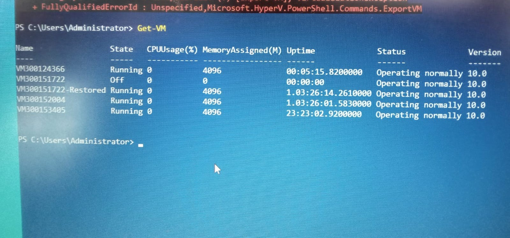
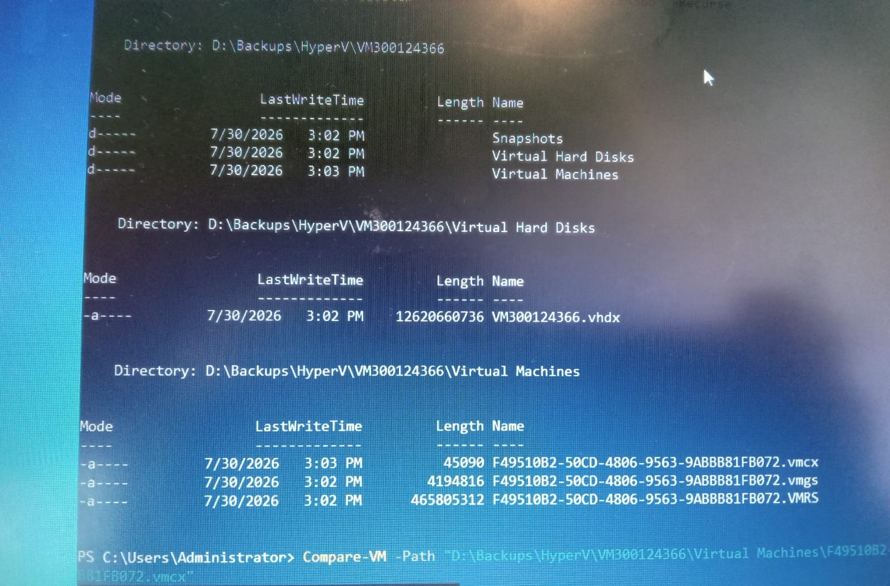

## Laboratoire Backup 

Cours: Administration des systèmes

Nom et Prénom: Bernard Rosemène

ID: 300124366

```

# Objectif

Ce laboratoire couvre la sauvegarde (export) et la restauration (import) d'une machine virtuelle Hyper-V à l'aide de PowerShell.


Etape et Action

- La première étape est la sauvegarde, qui consiste à faire un export complet de la VM afin de protéger ses données.
- Ensuite, on passe à l'étape de vérification, qui permet de lister toutes les VM disponibles et de comparer leurs informations.
- L'étape de restauration consiste à importer la VM dans l'environnement Hyper-V à partir du fichier exporté précédemment.
- Une fois la VM restaurée, l'étape de démarrage permet de la lancer pour vérifier que tout fonctionne correctement.
- Enfin, avant toute sauvegarde, il faut effectuer un arrêt propre de la VM afin d'éviter toute perte de données ou tout dommage au système de fichiers.

```





