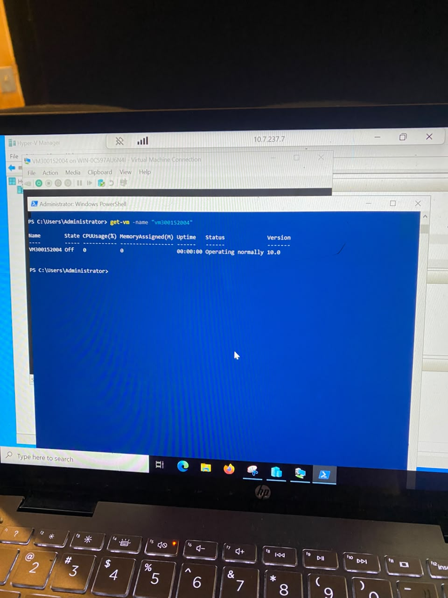
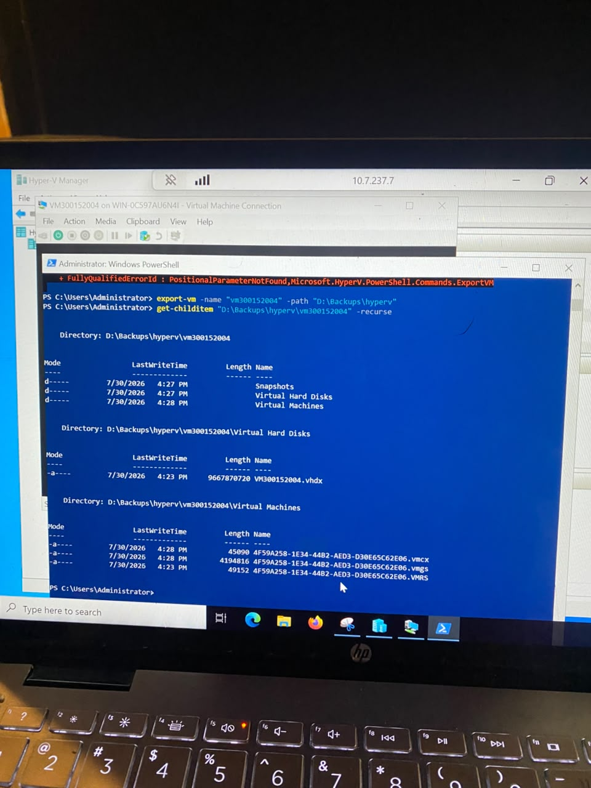
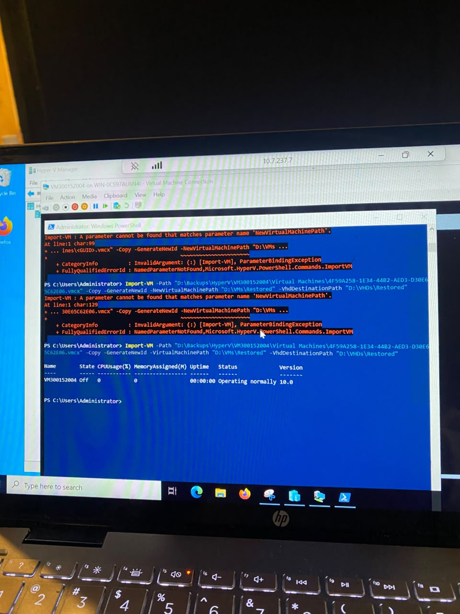
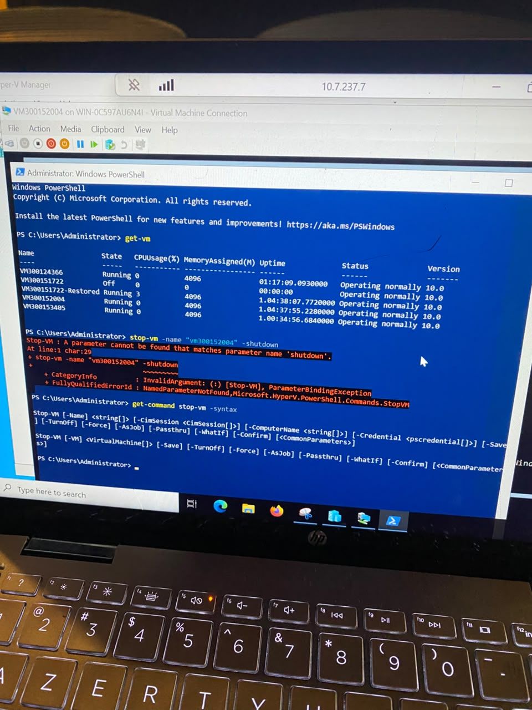
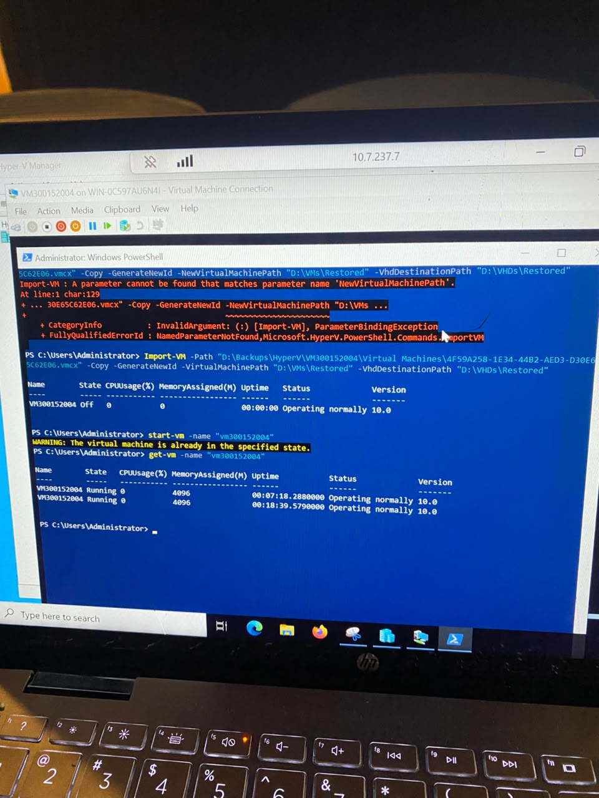

300152004

****

Dans ce lab j'ai sauvegardé et restauré une machine virtuelle Hyper-V avec PowerShell; j'ai exporté une VM existante vers un dossier de sauvegarde (Export-VM), puis la réimporter soit à son emplacement d'origine, soit comme copie indépendante avec un nouvel identifiant.

-étape 1: 

Avant de lancer la sauvegarde, je vérifie l'état actuel de la VM avec `Get-VM -Name "vm300152004"`. Elle est à l'état `Off` , ce qui est recommandé avant un export pour garantir une sauvegarde cohérente des fichiers de la VM.

-étape 2:

La commande `Get-ChildItem "D:\Backups\hyperv\vm300152004" -Recurse` confirme la structure standard générée par Hyper-V.

-étape 3:

la commande `Import-VM -Path "...\GUID.vmcx" -Copy -GenerateNewId -VirtualMachinePath "D:\VMs\Restored" -VhdDestinationPath "D:\VHDs\Restored"` s'exécute avec succès, et `Get-VM` confirme que VM300152004 existe (état `Off` à ce stade, juste après l'import).

-étape 4:

Je tente ensuite un arrêt propre avec `Stop-VM -Name "vm300152004" -shutdown.

-étape 5:

Après l'import réussi, j'exécute `Start-VM -Name "vm300152004"`. PowerShell renvoie l'avertissement "The virtual machine is already in the specified state", car la VM était déjà démarrée. La commande `Get-VM -Name "vm300152004"` confirme qu'il existe désormais deux VM nommées `VM300152004`, toutes deux à l'état `Running`, l'originale et la copie importée.

