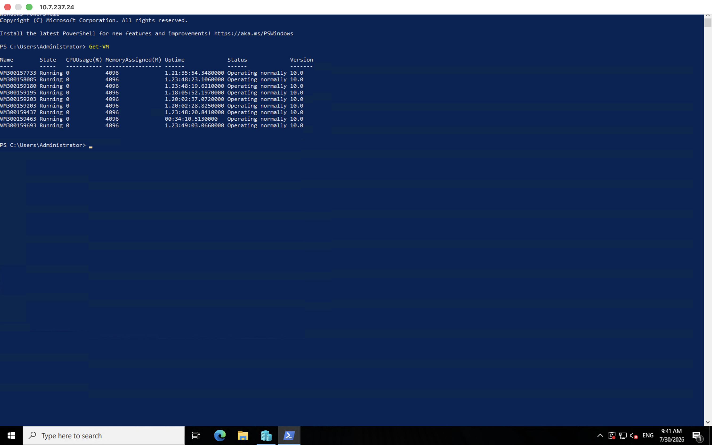
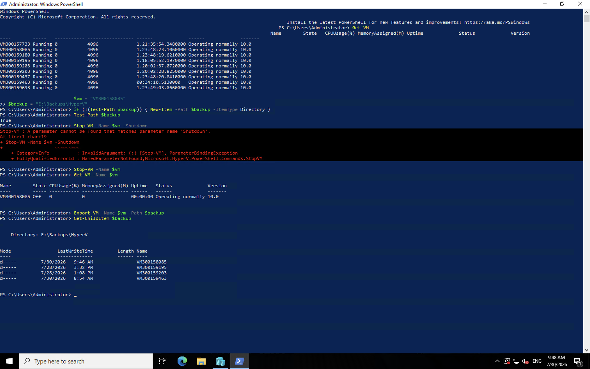
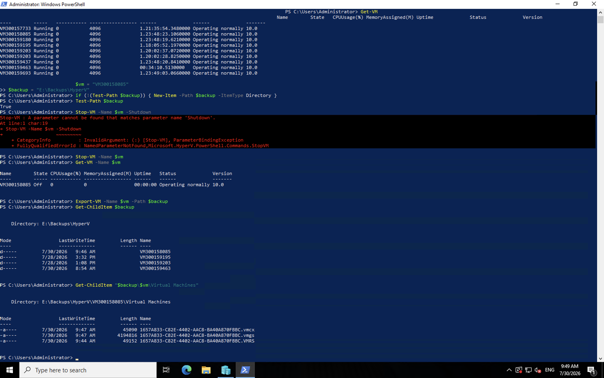
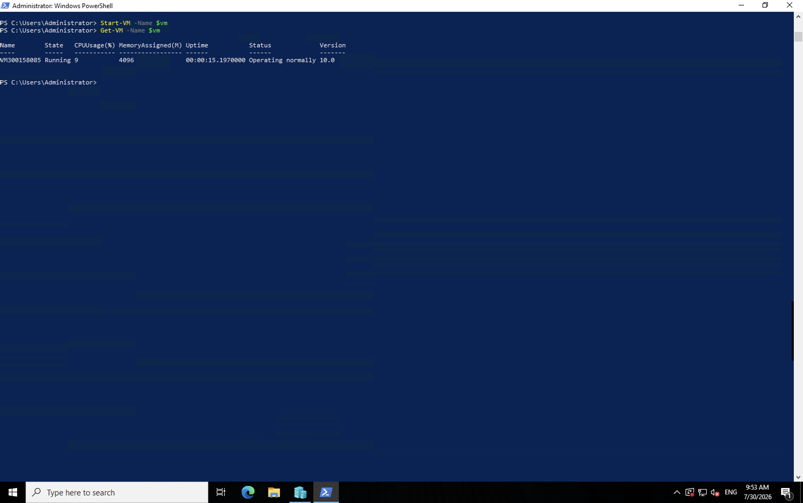
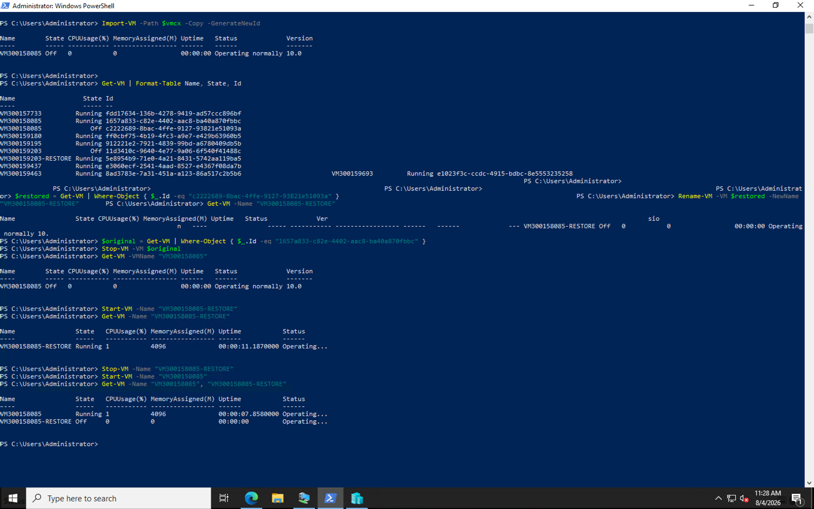

cat > "9.backup/300158085/README.md" <<'EOF'
# Laboratoire Backup Hyper-V

## Identification

- Cours : INF1092
- Sujet : Sauvegarde et restauration d’une machine virtuelle Hyper-V
- Numéro étudiant : 300158085
- VM utilisée : `VM300158085`
- Chemin de sauvegarde : `E:\Backups\HyperV`

---

## Objectif du laboratoire

L’objectif de ce laboratoire était de sauvegarder et de restaurer une machine virtuelle Hyper-V avec PowerShell.  
J’ai utilisé `Export-VM` pour exporter ma VM dans un dossier de sauvegarde. J’ai ensuite vérifié les fichiers créés, importé la sauvegarde comme une copie et démarré la VM restaurée pour confirmer son bon fonctionnement.

---

## Étape 1 : Vérifier les machines virtuelles

J’ai commencé par afficher les machines virtuelles disponibles avec la commande :

```powershell
Get-VM
```

Cette commande permet de voir les machines virtuelles présentes sur le serveur Hyper-V, leur état et leurs informations principales.



---

## Étape 2 : Préparer le dossier de sauvegarde

J’ai défini le nom de ma VM et le chemin de sauvegarde avec les variables suivantes :

```powershell
$vm = "VM300158085"
$backup = "E:\Backups\HyperV"
```

Ensuite, j’ai vérifié que le dossier de sauvegarde existait avec :

```powershell
Test-Path $backup
```

Le résultat `True` confirme que le chemin de sauvegarde est valide.

---

## Étape 3 : Arrêter la VM avant la sauvegarde

Avant de faire l’exportation, j’ai arrêté la VM avec :

```powershell
Stop-VM -Name $vm
```

Puis j’ai vérifié son état avec :

```powershell
Get-VM -Name $vm
```

La VM était bien à l’état `Off`, ce qui permet d’effectuer une sauvegarde plus propre.



---

## Étape 4 : Exporter la machine virtuelle

J’ai lancé la sauvegarde avec la commande :

```powershell
Export-VM -Name $vm -Path $backup
```

Après l’exportation, j’ai vérifié le dossier de sauvegarde avec :

```powershell
Get-ChildItem $backup
```

Le dossier `VM300158085` apparaît bien dans `E:\Backups\HyperV`.  
Cela confirme que l’exportation de la machine virtuelle a été créée correctement.

---

## Étape 5 : Vérifier les fichiers exportés

J’ai vérifié les fichiers de configuration de la VM exportée avec :

```powershell
Get-ChildItem "$backup\$vm\Virtual Machines"
```

Le fichier `.vmcx` est présent dans le dossier `Virtual Machines`.  
Ce fichier contient la configuration nécessaire pour importer ou restaurer la machine virtuelle.



---

## Étape 6 : Redémarrer la VM après la sauvegarde

Après l’exportation, j’ai redémarré la VM originale avec :

```powershell
Start-VM -Name $vm
```

Puis j’ai vérifié son état avec :

```powershell
Get-VM -Name $vm
```

La VM est revenue à l’état `Running`, ce qui confirme qu’elle fonctionne correctement après la sauvegarde.



---

## Étape 7 : Localiser le fichier de configuration exporté

Pour récupérer automatiquement le chemin du fichier `.vmcx`, j’ai utilisé les commandes suivantes :

```powershell
$vmcx = Get-ChildItem "$backup\$vm\Virtual Machines\*.vmcx" |
Select-Object -First 1 -ExpandProperty FullName

$vmcx
```

PowerShell a retourné le chemin suivant :

```text
E:\Backups\HyperV\VM300158085\Virtual Machines\1657A833-C82E-4402-AAC8-BA40A870FBBC.vmcx
```

J’ai ensuite vérifié la VM exportée avec :

```powershell
Compare-VM -Path $vmcx
```

La commande a signalé qu’une machine virtuelle avec le même identifiant existait déjà. Cette situation était normale, car la VM originale était toujours enregistrée sur le même serveur Hyper-V.

---

## Étape 8 : Importer la VM comme une copie

Pour éviter le conflit d’identifiant, j’ai importé la sauvegarde comme une copie avec un nouvel identifiant :

```powershell
Import-VM -Path $vmcx -Copy -GenerateNewId
```

L’importation a réussi. J’ai ensuite affiché les VM et leurs identifiants avec :

```powershell
Get-VM | Format-Table Name, State, Id
```

La VM originale conservait l’identifiant :

```text
1657a833-c82e-4402-aac8-ba40a870fbbc
```

La copie restaurée avait reçu le nouvel identifiant :

```text
c2222689-8bac-4ffe-9127-93821e51093a
```

---

## Étape 9 : Renommer la VM restaurée

Après l’importation, les deux VM portaient temporairement le même nom. J’ai sélectionné la copie restaurée grâce à son nouvel identifiant :

```powershell
$restored = Get-VM | Where-Object {
    $_.Id -eq "c2222689-8bac-4ffe-9127-93821e51093a"
}
```

Je l’ai ensuite renommée avec la commande :

```powershell
Rename-VM -VM $restored -NewName "VM300158085-RESTORE"
```

J’ai vérifié le nouveau nom et l’état de la VM avec :

```powershell
Get-VM -Name "VM300158085-RESTORE"
```

La VM restaurée apparaissait à l’état `Off` et fonctionnait normalement.

---

## Étape 10 : Tester la VM restaurée

Avant de démarrer la VM restaurée, j’ai arrêté la VM originale pour éviter un conflit de nom, de réseau ou d’adresse IP.

J’ai sélectionné la VM originale avec son identifiant :

```powershell
$original = Get-VM | Where-Object {
    $_.Id -eq "1657a833-c82e-4402-aac8-ba40a870fbbc"
}
```

Je l’ai ensuite arrêtée et j’ai vérifié son état :

```powershell
Stop-VM -VM $original
Get-VM -VMName "VM300158085"
```

La VM originale était bien à l’état `Off`.

J’ai ensuite démarré la VM restaurée :

```powershell
Start-VM -Name "VM300158085-RESTORE"
```

Puis j’ai vérifié son état :

```powershell
Get-VM -Name "VM300158085-RESTORE"
```

La VM restaurée était à l’état `Running` avec `4096` Mo de mémoire attribuée. Ce résultat confirme que l’importation et la restauration ont réussi.

---

## Étape 11 : Remettre l’environnement dans son état normal

Après avoir vérifié le fonctionnement de la VM restaurée, je l’ai arrêtée :

```powershell
Stop-VM -Name "VM300158085-RESTORE"
```

J’ai ensuite redémarré la VM originale :

```powershell
Start-VM -Name "VM300158085"
```

Enfin, j’ai vérifié l’état des deux machines virtuelles :

```powershell
Get-VM -Name "VM300158085", "VM300158085-RESTORE"
```

Le résultat final confirme que :

- `VM300158085` est à l’état `Running` ;
- `VM300158085-RESTORE` est à l’état `Off`.

La capture suivante montre l’importation, le nouvel identifiant, le renommage, le démarrage réussi de la VM restaurée et la remise en état finale de l’environnement.



---

## Difficultés rencontrées

Pendant le laboratoire, j’ai rencontré une difficulté avec cette commande :

```powershell
Stop-VM -Name $vm -Shutdown
```

PowerShell a affiché une erreur parce que le paramètre `-Shutdown` n’était pas reconnu dans cet environnement.

Pour continuer, j’ai utilisé la commande compatible :

```powershell
Stop-VM -Name $vm
```

J’ai également obtenu une erreur avec `Compare-VM`, car la VM originale existait encore avec le même identifiant.

Pour éviter ce conflit, j’ai importé la sauvegarde comme une copie avec un nouvel identifiant :

```powershell
Import-VM -Path $vmcx -Copy -GenerateNewId
```

Cette méthode m’a permis de conserver la VM originale et de créer une copie restaurée distincte.

---

## Résultat obtenu

À la fin du laboratoire, j’ai réussi à :

- afficher les VM avec `Get-VM` ;
- préparer et vérifier le chemin de sauvegarde ;
- arrêter la VM avant l’exportation ;
- exporter la VM avec `Export-VM` ;
- vérifier la présence du fichier `.vmcx` ;
- redémarrer la VM après la sauvegarde ;
- importer la sauvegarde avec `Import-VM` ;
- générer un nouvel identifiant pour éviter un conflit ;
- renommer la copie `VM300158085-RESTORE` ;
- démarrer et tester la VM restaurée ;
- confirmer que la VM restaurée était à l’état `Running` ;
- arrêter la copie restaurée et redémarrer la VM originale.

---

## Conclusion

Ce laboratoire m’a permis de comprendre comment sauvegarder et restaurer une machine virtuelle Hyper-V avec PowerShell.

Les deux commandes principales à retenir sont :

```powershell
# Sauvegarde
Export-VM -Name "Nom_VM" -Path "Chemin_Sauvegarde"

# Restauration
Import-VM -Path "Chemin_VM_Exportee\VM.vmcx" -Copy -GenerateNewId
```

L’exportation permet de conserver les fichiers nécessaires à la récupération d’une machine virtuelle. L’importation permet ensuite de recréer la VM en cas de panne, d’erreur ou de mauvaise manipulation.
EOF
